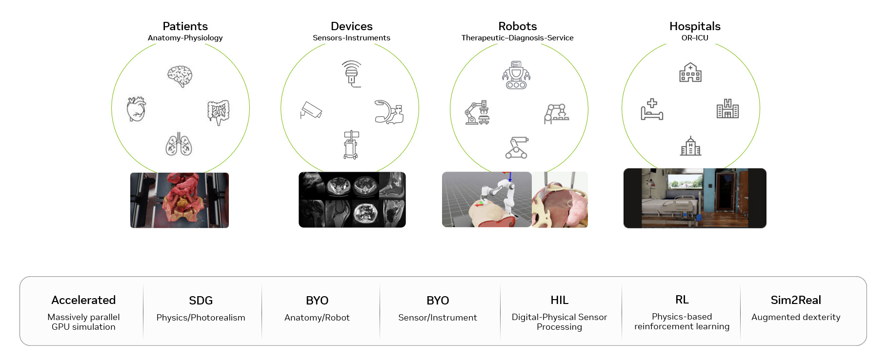

# Isaac for Healthcare - Workflows

## Overview

This repository contains **healthcare robotics workflows** - complete, end-to-end implementations that demonstrate how to build, simulate, and deploy robotic systems for specific medical applications using the [Nvidia Isaac for Healthcare](https://github.com/isaac-for-healthcare) platform.

## Table of Contents

- [Available Workflows](#available-workflows)
- [Contributing](#contributing)
- [Support](#support)

## What are Workflows?

Workflows are comprehensive reference implementations that showcase the complete development pipeline from simulation to real-world deployment. Each workflow includes digital twin environments, AI model training capabilities, and deployment frameworks for specific healthcare robotics applications.

## Available Workflows

This repository currently includes four main workflows:

- **[SO-ARM Starter](./workflows/so_arm_starter/README.md)** - Surgical assistant robotics system featuring SO-ARM101 manipulator control with complete data collection, policy training, and deployment pipeline. Implements GR00T N1.5 diffusion policy for autonomous surgical instrument handling, precise tool positioning, and workspace organization using dual RGB camera streams (640x480@30fps room/wrist views) and 6-DOF joint state feedback. Features physics-based simulation environments, imitation learning from both real-world and simulated demonstrations, real-time policy inference generating 16-step action sequences, and RTI DDS middleware for distributed robot communication.
- **[Robotic Surgery](./workflows/robotic_surgery/README.md)** - Physics-based surgical robot simulation framework with photorealistic rendering for developing autonomous surgical skills. Supports da Vinci Research Kit (dVRK), dual-arm configurations, and STAR surgical arms. This workflow enables researchers and medical device companies to train AI models for surgical assistance, validate robot behaviors safely, and accelerate development through GPU-parallelized reinforcement learning. Includes pre-built surgical subtasks like suture needle manipulation and precise reaching tasks.
- **[Robotic Ultrasound](./workflows/robotic_ultrasound/README.md)** - Comprehensive autonomous ultrasound imaging system featuring physics-accurate sensor simulation through GPU-accelerated raytracing that models wave propagation, tissue interactions, and acoustic properties in real-time. The simulator generates photorealistic B-mode images for synthetic data generation without physical hardware. Supports multiple AI policies (PI0, GR00T N1), RTI DDS, and Holoscan deployment. Enables researchers and developers to train scanning protocols and validate autonomous imaging through GPU-accelerated simulation before clinical deployment.
- **[Telesurgery](./workflows/telesurgery/README.md)** - Real-time remote surgical operations framework supporting both simulated and physical environments with low-latency video streaming, haptic feedback, and distributed control systems. This workflow features H.264/HEVC hardware-accelerated video encoding, RTI DDS communication, cross-platform deployment (x86/AARCH64), and seamless sim-to-real transition. Designed for surgical robotics companies, medical device manufacturers, and telemedicine providers to develop remote surgical capabilities, validate teleoperation systems, and deploy scalable telesurgery solutions across different network conditions.
- **[Rheo](./workflows/rheo/README.md)** - Smart Hospital Digital Twin blueprint for automation and Physical AI development. Combines physical agents (GR00t Vision-Language-Action models) for loco-manipulation and manipulation tasks, and digital agents (VLM-based) for monitoring and assistance. Features a dual-track simulation environment with NVIDIA Isaac Sim/Lab for rapid task composition (IsaacLab-Arena) and precision manipulation training (IsaacLab), enabling efficient iteration on tasks, synthetic data generation, and policy learning before real-world deployment.

Each workflow provides complete simulation environments, training datasets, pre-trained models, and deployment tools to accelerate your healthcare robotics development.

Please see the [Changelog](./CHANGELOG.md) for details on our milestone releases.

## Contributing

We wholeheartedly welcome contributions from the community to make this framework mature and useful for everyone. Contributions can be made through:

- Bug reports
- Feature requests
- Code contributions
- Documentation improvements
- Tutorial additions

Please check our [contribution guidelines](./CONTRIBUTING.md) for detailed information on:

- Development setup
- Code style guidelines
- Pull request process
- Issue reporting
- Documentation standards

## Support

For support and troubleshooting:

1. Check the [documentation](https://github.com/isaac-for-healthcare/i4h-workflows/tree/main/docs)
2. Search existing [issues](https://github.com/isaac-for-healthcare/i4h-workflows/issues)
3. [Submit a new issue](https://github.com/isaac-for-healthcare/i4h-workflows/issues/new) for:
    - Bug reports
    - Feature requests
    - Documentation improvements
    - General questions
