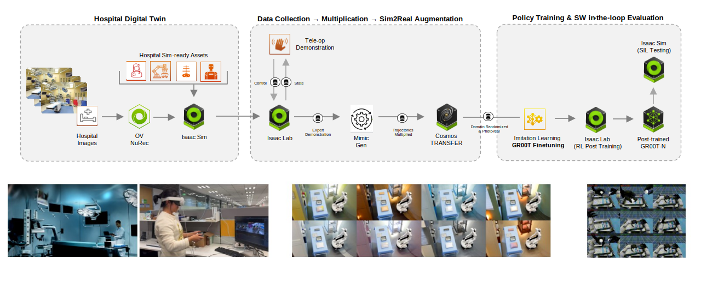

# 🏥 Rheo Workflow



---

## 🔬 Technical Overview

Rheo is a blueprint for smart hospital automation and Physical AI development, designed for healthcare robotics researchers and developers building intelligent, autonomous clinical environments, starting with the Operating Room (OR). Healthcare faces a structural demand–capacity crisis: a projected global shortfall of millions of clinicians, costly OR inefficiencies, and billions of diagnostic exams with significant unmet demand. The future hospital must be automation-enabled, where robotics extends clinician capacity, increases procedural throughput, and democratizes access to high-quality care.
However, hospitals are heterogeneous, high-stakes environments—every facility has different layouts, workflows, equipment, and patient populations—making it economically and operationally infeasible to capture exhaustive real-world training data across every edge case. Rheo addresses this through simulation-first development, providing a complete pipeline from digital twin composition through demonstration capture, synthetic data generation, policy training, and pre-deployment validation, all built on NVIDIA Isaac Sim and Isaac Lab.

The workflow provides an end-to-end development pipeline for Physical AI in clinical settings:

- **Digital Twin Composition**: Rapid environment assembly using two complementary simulation tracks—[Isaac Lab-Arena](https://github.com/isaac-sim/IsaacLab-Arena) for OR-scale task composition (swapping scenes, objects, and embodiments with minimal friction) and [Isaac Lab](https://github.com/isaac-sim/IsaacLab) for task-centric, manager-based environments that pair with curriculum design and large-scale RL for precision manipulation.
- **Expert Demonstration Capture**: Teleoperation interfaces for recording task demonstrations in simulation—keyboard-based control for loco-manipulation tasks (surgical tray pick-and-place, case cart pushing) and Meta Quest controllers for precision bimanual manipulation (trocar assembly).
- **Synthetic Data Generation**: Simulation-driven data amplification using Isaac Lab Mimic/SkillGen-style pipelines to systematically diversify a small set of demonstrations into larger training datasets, combined with Cosmos Transfer 2.5 guided generation for cross-scene generalization across different hospital environments.
- **Policy Training**: Supervised fine-tuning (SFT) of GR00T Vision-Language-Action models (N1.5/N1.6) on curated datasets, with online RL post-training (PPO via RLinf) to push precision manipulation stages—such as multi-step trocar assembly—over the line.
- **Pre-Deployment Validation**: Task-level evaluation runners for closed-loop policy assessment, plus end-to-end integration testing with WebRTC camera streaming and trigger-based action execution for system-level verification before physical deployment.

## 📋 Table of Contents

- [🚀 Quick Start](#-quick-start)
- [🏠 Environment Requirements](#-environment-requirements)
- [⚡ Running Workflows](#-running-workflows)
- [🛠 Troubleshooting](#-troubleshooting)
- [📚 Attribution & Citation](#-attribution-and-citation)

---

## 🚀 Quick Start

Clone the repository

  ```bash
  git clone https://github.com/isaac-for-healthcare/i4h-workflows.git
  cd i4h-workflows
  ```

Prepare models directories (default `$HOME/models`) and install `huggingface-hub`

```bash
mkdir -p $HOME/models
pip install huggingface-hub
```

Run Individual Task Inference and Evaluation

Estimated Setup Duration: 30-40 minutes for Cloning Repositories and Docker Build.

### Loco-Manipulation Task: Surgical Tray Pick and Place

```bash
# Download GR00T-N1.6-Rheo-PickNPlaceTray model
hf download nvidia/GR00T-N1.6-Rheo-PickNPlaceTray --local-dir $HOME/models/GR00T-N1.6-Rheo-PickNPlaceTray
# Use Gr00t N1.6 environment
./workflows/rheo/docker/run_docker.sh -g1.6  \
  python scripts/simulation/examples/policy_runner.py \
    --policy_type gr00t_closedloop \
    --policy_config_yaml_path scripts/config/g1_gr00t_closedloop_pick_and_place_config.yaml \
    --num_steps 15000 \
    --enable_cameras \
    --success_hold_steps 150 \
    g1_locomanip_tray_pick_and_place \
    --object surgical_tray \
    --embodiment g1_wbc_joint
```

### Manipulation Task: Assemble Trocar

```bash
# Download GR00T-N1.5-RL-Rheo-AssembleTrocar model
hf download nvidia/GR00T-N1.5-RL-Rheo-AssembleTrocar --local-dir $HOME/models/GR00T-N1.5-RL-Rheo-AssembleTrocar
# Use Gr00t N1.5 environment
./workflows/rheo/docker/run_docker.sh -g1.5 \
  python -u scripts/simulation/examples/eval_assemble_trocar.py \
    --enable_cameras \
    --task Isaac-Assemble-Trocar-G129-Dex3-Joint \
    --model_path /models/GR00T-N1.5-RL-Rheo-AssembleTrocar \
    --rl_ckpt \
    --num_episodes 10 \
    --max_steps 500
```

## 🏠 Environment Requirements

### System Prerequisites Validation

#### GPU Architecture Requirements

- **NVIDIA GPU**: Simulation environment requires Ada Lovelace or later
- **Compute Capability**: ≥8.9
- **VRAM**: ≥24GB GDDR6/HBM (for Simulation & Policy Inference) and ≥48GB GDDR6/HBM (with additional Agent Framework)

#### Driver & System Requirements

- **Operating System**: Ubuntu 22.04 LTS / 24.04 LTS (x86_64)
- **NVIDIA Driver**: ≥580.x (RTX ray tracing API support)
- **Memory Requirements**: ≥24GB GPU memory (inference and simulation), ≥64GB system RAM
- **Storage**: ≥150GB NVMe SSD (asset caching and model downloading)

#### Software Dependencies

- [Docker with Buildx enabled](https://docs.docker.com/engine/install/ubuntu/)
- [NVIDIA Container Toolkit](https://docs.nvidia.com/datacenter/cloud-native/container-toolkit/latest/install-guide.html)

## ⚡ Running Workflows

### Running Agent Workflow

#### Run Physical Agent

This is a minimal example to run the physical agent in Isaac Sim, in which the camera is streamed to the VLM Surgical Agent Framework via WebRTC.

```bash
./workflows/rheo/docker/run_docker.sh -g1.6 \
  python scripts/simulation/examples/triggered_policy_runner.py \
    --enable_cameras \
    --webrtc_cam \
    --webrtc_host 0.0.0.0 \
    --webrtc_port 8080 \
    --webrtc_fps 30 \
    --trigger_port 8081 \
    --trigger_host 0.0.0.0 \
    g1_locomanip_tray_pick_and_place \
    --object surgical_tray \
    --embodiment g1_wbc_joint
```

OR simply observe the surgical tray:

```bash
./workflows/rheo/docker/run_docker.sh -g1.6 \
  python scripts/simulation/examples/observe_runner.py \
    --num_steps 15000 \
    --enable_cameras \
    --webrtc_cam \
    --webrtc_host 0.0.0.0 \
    --webrtc_port 8080 \
    --webrtc_fps 30 \
    observe_object \
    --object surgical_tray_no_lid \
    --embodiment g1_wbc_pink
```

#### Run the Vision Language Model (VLM) Agent

```bash
./tools/env_setup/install_vlm_surgical_agent_fx.sh
```

Open a web browser and navigate to `http://127.0.0.1:8050` to see the camera stream. Click the "livestream" button to connect to `http://localhost:8080` WebRTC server. Click the "play" button to start the video stream.

You can start interacting with the VLM agent by chatting with it or Use the "Start Mic" button to start speaking.

The agent will respond to your messages in real-time, as well as providing suggested actions based on the camera stream.

When you'd like to reset the environment, switch the window to the Isaac Sim window and press the "R" key to reset the environment. After the environment is reset, you also need to disconnect and reconnect the WebRTC server to reset the monitoring systems.

### Individual Task Inference and Evaluation

#### Assemble Trocar

```bash
# Download GR00T-N1.5-RL-Rheo-AssembleTrocar model
hf download nvidia/GR00T-N1.5-RL-Rheo-AssembleTrocar --local-dir $HOME/models/GR00T-N1.5-RL-Rheo-AssembleTrocar
# Start Gr00t N1.5 container and run Assemble Trocar evaluation
./workflows/rheo/docker/run_docker.sh -g1.5 \
  python -u scripts/simulation/examples/eval_assemble_trocar.py \
    --enable_cameras \
    --task Isaac-Assemble-Trocar-G129-Dex3-Joint \
    --model_path /models/GR00T-N1.5-RL-Rheo-AssembleTrocar \
    --rl_ckpt \
    --num_episodes 10 \
    --max_steps 500
```

Notes:

- **`--headless`** and **`--enable_cameras`** are Isaac Lab / AppLauncher options (pass them if you need cameras/rendering).
- **`--rl_ckpt`** automatically applies runtime patches to `Gr00tPolicy` to ensure consistency with RL post-training modifications made by RLinf. **If you are not using RL-trained checkpoints, DO NOT pass this flag.** The patch modifies:
  - **Eagle input padding**: Pads `eagle_input_ids` and `eagle_attention_mask` to a fixed length of 850
  - **Dropout removal**: Replaces all dropout layers with `nn.Identity()` for deterministic inference
  - **Data type handling**: Converts tensors to `bfloat16`

  These modifications match exactly what RLinf applies during RL training, ensuring evaluation uses the same model behavior. See [`tools/env_setup/patches/gr00t_policy_padding_dropout.patch`](../../tools/env_setup/patches/gr00t_policy_padding_dropout.patch) for implementation details.
- Results are written under **`workflows/rheo/scripts/simulation/examples/eval_results/`** (relative to the run directory) and videos under **`--video_dir`**.

#### Surgical Tray Pick and Place

```bash
# Download GR00T-N1.6-Rheo-Sim-PickNPlaceTray model
hf download nvidia/GR00T-N1.6-Rheo-PickNPlaceTray --local-dir $HOME/models/GR00T-N1.6-Rheo-PickNPlaceTray
# Use Gr00t N1.6 environment
./workflows/rheo/docker/run_docker.sh -g1.6  \
  python scripts/simulation/examples/policy_runner.py \
    --policy_type gr00t_closedloop \
    --policy_config_yaml_path scripts/config/g1_gr00t_closedloop_pick_and_place_config.yaml \
    --num_steps 15000 \
    --enable_cameras \
    --success_hold_steps 150 \
    g1_locomanip_tray_pick_and_place \
    --object surgical_tray \
    --embodiment g1_wbc_joint
```

#### Surgical Case Cart Pushing

```bash
# Download GR00T-N1.6-Rheo-Sim-PushCart model
hf download nvidia/GR00T-N1.6-Rheo-Sim-PushCart --local-dir $HOME/models/GR00T-N1.6-Rheo-Sim-PushCart
# Use Gr00t N1.6 environment
./workflows/rheo/docker/run_docker.sh -g1.6 \
  python scripts/simulation/examples/policy_runner.py \
    --policy_type gr00t_closedloop \
    --policy_config_yaml_path scripts/config/g1_gr00t_closedloop_push_cart_config.yaml \
    --num_steps 20000 \
    --enable_cameras \
    --success_hold_steps 45 \
    g1_locomanip_push_cart \
    --object cart \
    --embodiment g1_wbc_joint
```

Notes:

- To use TensorRT for inference, first follow the TensorRT steps in [GR00T](https://github.com/NVIDIA/Isaac-GR00T/tree/31c1c36346f3decc252a7bb04e19948ca7ce0e9d/scripts/deployment#readme) to convert the PyTorch model.
- Set `trt_engine_path: /path/to/dit_model_bf16.trt` in the config YAML.

### Create Your Own Tasks/Datasets/Models

You can create your own tasks/datasets/models by following the instructions below.

#### Tasks Setup

One of the core features of the Rheo blueprint is the rapid composition of new environments and tasks using the IsaacLab-Arena [Concepts](https://isaac-sim.github.io/IsaacLab-Arena/release/0.1.1/pages/concepts/concept_overview.html). Refer to [g1_locomanip_tray_pick_and_place_environment.py](scripts/simulation/environments/g1_locomanip_tray_pick_and_place_environment.py) for an example of how to define a locomotion-manipulation task—specifically, having the Unitree G1 robot pick up a surgical tray and place it onto a cart within a pre-operative room scene.

For precision, multi-stage bimanual manipulation such as Assemble Trocar, Rheo uses a focused Isaac Lab track where the OR twin is defined explicitly as a scene configuration: robot, cameras, USD scene, objects, and lighting. It follows the Isaac lab convention and uses this [task package structure](scripts/simulation/tasks/assemble_trocar/):

- **Gym env id**: `Isaac-Assemble-Trocar-G129-Dex3-Joint`
- **registration**: `simulation.tasks.assemble_trocar.__init__` calls `gym.register(...)`
- **env cfg entry point**: `simulation.tasks.assemble_trocar.g1_assemble_trocar_env_cfg.G1AssembleTrocarEnvCfg`
- **task logic**:
  - `mdp/` contains events/observations/rewards/terminations
  - `config/` contains robot + camera presets

#### Data Collection

Locomanipulation tasks (Surgical Tray Pick and Place, Surgical Case Cart Pushing) support both keyboard and XR teleoperation. The trocar assembly task requires XR teleoperation only. For XR teleoperation, first follow the [documentation](https://docs.nvidia.com/cloudxr-sdk/latest/usr_guide/cloudxr_runtime/index.html) to set up and connect Meta Quest.

#### Locomanipulation Tasks

**Keyboard teleoperation:**

```bash
./workflows/rheo/docker/run_docker.sh -g1.6 \
  python scripts/simulation/record_demos_locomanip.py \
  --dataset_file /datasets/demo.hdf5 \
  --num_demos 1 \
  --num_success_steps 50 \
  --step_hz 50 \
  --pos_sensitivity 0.01 \
  --vel_sensitivity 0.2 \
  --enable_cameras \
  --mimic \
  g1_locomanip_tray_pick_and_place \
  --object surgical_tray \
  --embodiment g1_wbc_pink
```

Optionally, you can replay keyboard teleoperation demos:

```bash
./workflows/rheo/docker/run_docker.sh -g1.6 \
  python scripts/simulation/replay_demos.py \
  --dataset_file /datasets/demo.hdf5 \
  --enable_cameras \
  g1_locomanip_tray_pick_and_place \
  --object surgical_tray \
  --embodiment g1_wbc_pink
```

**XR teleoperation (Meta Quest):**

```bash
./workflows/rheo/docker/run_docker.sh -g1.5 \
  python scripts/simulation/record_demos_locomanip.py \
  --dataset_file /datasets/tray_xr_demo.hdf5 \
  --num_demos 1 \
  --num_success_steps 50 \
  --enable_pinocchio \
  --enable_cameras \
  --xr \
  --teleop_device motion_controllers \
  g1_locomanip_tray_pick_and_place \
  --object surgical_tray \
  --embodiment g1_wbc_pink
```

#### Trocar Assembly Task (XR only)

```bash
./workflows/rheo/docker/run_docker.sh -g1.5 \
  python scripts/simulation/record_demos_assemble_trocar.py \
  --task Isaac-Assemble-Trocar-G129-Dex3-Teleop \
  --teleop_device motion_controllers \
  --enable_pinocchio \
  --enable_cameras \
  --num_demos 1 \
  --xr
```

#### Synthetic Data Generation

##### Mimic Gen

**NOTE**: Currently, only the locomotion tasks are supported for synthetic data generation with Isaac Lab Mimic/SkillGen and Cosmos Transfer 2.5:

First, you need to annotate the demos with the following command. This process requires a definition of the subtasks in the task package.

```bash
./workflows/rheo/docker/run_docker.sh -g1.6 \
  python scripts/simulation/annotate_demos.py \
  --input_file /datasets/demo.hdf5 \
  --output_file /datasets/demo_annotated.hdf5 \
  --enable_cameras \
  --mimic \
  g1_locomanip_tray_pick_and_place \
  --object surgical_tray \
  --embodiment g1_wbc_pink
```

Then, you can generate the synthetic data with the following command with Mimic Gen

```bash
# generate 10 successful demos
./workflows/rheo/docker/run_docker.sh -g1.6 \
  python scripts/simulation/generate_dataset.py \
  --enable_cameras \
  --mimic \
  --num_steps 150 \
  --headless \
  --input_file /datasets/demo_annotated.hdf5 \
  --output_file /datasets/demo_generated.hdf5 \
  --generation_num_trials 10 \
  g1_locomanip_tray_pick_and_place \
  --object surgical_tray \
  --embodiment g1_wbc_pink
```

If you want to merge multiple generated demos into a single dataset, you can use the following command:

```bash
./workflows/rheo/docker/run_docker.sh -g1.6 \
  python scripts/simulation/merge_demos.py \
  --input /datasets/demo_annotated*.hdf5 \
  --output /datasets/demo_merged.hdf5
```

##### Cross-Scene Generalization Benchmark with Cosmos Transfer 2.5

We also leveraged [Cosmos Transfer 2.5](https://github.com/nvidia-cosmos/cosmos-transfer2.5) combined with guided generation to augment training data and improve model generalization across diverse environments. Please check out this [Cosmos Transfer 2.5 Tutorial](https://github.com/isaac-for-healthcare/i4h-tutorials/tree/main/synthetic-data-generation/hospital_digital_twin/generate_photoreal_variants/cosmos_transfer2.5) for detailed instructions. We evaluate both the base model and the Cosmos-augmented model on the [Surgical Tray Pick and Place](#surgical-tray-pick-and-place) task across four distinct scenes, with around 200 evaluation episodes per scene.

**Benchmark Results (Success Rate):**

| Model | Scene 1 | Scene 2 | Scene 3 | Scene 4 |
| ------- | --------- | --------- | --------- | --------- |
| Base Model | 0.64 | 0.31 | 0.00 | 0.00 |
| Cosmos Augmented Model | 0.60 | 0.49 | 0.37 | 0.30 |

**Scene Descriptions:**

- Scene 1: Original scene
- Scene 2: Original scene with modified floor, wall, and shelf textures
- Scene 3: Factory scene with different scene style, room layouts, lighting, and objects
- Scene 4: Operating Room scene with different scene style, room layouts, lighting, and objects

#### Fine-Tuning and Reinforcement Learning

Please check the following fine-tuning and reinforcement learning recipes for detailed instructions:

- [Assemble Trocar Fine-Tuning Recipe](./docs/assemble_trocar_finetuning.md)
- [Loco-Manipulation Fine-Tuning Recipe](./docs/locomanip_finetuning.md)
- [Reinforcement Learning Recipe](./docs/assemble_trocar_rl_guide.md)

After fine-tuning or reinforcement learning, you can evaluate the success rate of the policy by following [Individual Task Inference and Evaluation](#individual-task-inference-and-evaluation) section.

## 🛠 Troubleshooting

- **Resetting the VLM Agent**:
  - After changing the agent configuration or a system restart, you need to reset the UI container to reload the agent configurations. Otherwise, it could lead to unexpected behavior by using the default agent in the VLM-Surgical-Agent-Framework repository.
  - To reset the UI container, you can run the following command: `./tools/env_setup/install_vlm_surgical_agent_fx.sh -r`
  - When the agents are loaded successfully, you should see output similar to:

    ```text
    Available agents: ChatAgent, PeriOpChatAgent, NotetakerAgent, UserCommandAgent ...
    ```

- **Resetting the Internal State of the VLM Agent When Running**:
  - You can simply disconnect and reconnect the WebRTC server to reset the monitoring systems.

- **Environment creation fails with carb render setting errors**:
  - Some Isaac Sim/Kit builds don't expose certain carb render settings. If you see errors mentioning a path like
    `'/rtx/raytracing/fractionalCutoutOpacity' ... does not map to a carb setting`,
    update the env config to avoid setting it unconditionally.

- **I used a USB camera for the VLM Agent, but the image streaming is black**:
  - If you are using an Ubuntu system, please ensure your user has access to the camera by adding the user to the `video` group, and verify that you are using the correct camera index. Please check the [VLM-Surgical-Agent-Framework WebRTC USB camera documentation](https://github.com/Project-MONAI/VLM-Surgical-Agent-Framework/tree/main/docker#webrtc-usb-camera-video-streaming) for details on how to set the camera index.

- **Use multiple environments for policy inference**:
  - We provide a git patch to accelerate the policy evaluation by using multiple environments:

    ```bash
    pushd third_party/IsaacLab-Arena
    git apply ../../tools/env_setup/patches/isaaclab_arena_wbc_multi_env.patch
    popd
    ```

    The patch fixes an issue in the IsaacLab Arena code that causes the Whole Body Control (WBC) policy evaluation to be affected by the shared internal state of the policy instance.

    Then you can run the policy evaluation with multiple environments by passing the `--num_envs` argument.

    Empirically, we found that using `num_envs=3` provides the best acceleration with the minimum impact on the policy performance. Using more environments may slow down the environment stepping speed and increase the risk of lowering the success rate of the policy in simulation.

- **Use multiple lerobot datasets for training**:
  - It is supported to provide a list of lerobot datasets for GR00T N1.5 fine-tuning, but not supported for GR00T N1.6.
  - We provide a patch to support multiple lerobot datasets for GR00T N1.6 fine-tuning:

  ```bash
  sed -i 's/dataset_path: str/dataset_path: list[str]/' gr00t/configs/finetune_config.py
  sed -i 's/"dataset_paths": \[ft_config\.dataset_path\]/"dataset_paths": ft_config.dataset_path/' gr00t/experiment/launch_finetune.py
  ```

  - Then you can run the fine-tuning with multiple datasets by passing the `--dataset_path` argument.
  - For example, to fine-tune a GR00T N1.6 model with two datasets:

  ```bash
  python gr00t/experiment/launch_finetune.py \
    --dataset_path /datasets/dataset1/lerobot /datasets/dataset2/lerobot \
    ...
  ```

---

## 📚 Attribution and Citation

### SimReady Assets

The SimReady Assets in this workflow are powered by [LightWheel](https://lightwheel.ai/). Please refer to the [Isaac for Healthcare Asset Catalog](https://github.com/isaac-for-healthcare/i4h-asset-catalog) for details.

### RL Training Framework

The RL training framework is powered by [RLinf](https://github.com/RLinf/RLinf). If you find the RL capabilities helpful, please cite:

```text
@article{yu2025rlinf,
  title={RLinf: Flexible and Efficient Large-scale Reinforcement Learning via Macro-to-Micro Flexibility},
  author={Yu, Chao and Wang, Yuanqing and Guo, Zhen and Lin, Hao and Xu, Si and Zang, Hongzhi},
  journal={arXiv preprint arXiv:2509.15965},
  year={2025}
}

@article{chen2025pi_,
  title={$$\backslash$pi\_$\backslash$texttt $\{$RL$\}$ $: Online RL Fine-tuning for Flow-based Vision-Language-Action Models},
  author={Chen, Kang and Liu, Zhihao and Zhang, Tonghe and Guo, Zhen and Xu, Si and Lin, Hao and Zang, Hongzhi and Zhang, Quanlu and Yu, Zhaofei and Fan, Guoliang and others},
  journal={arXiv preprint arXiv:2510.25889},
  year={2025}
}
```
