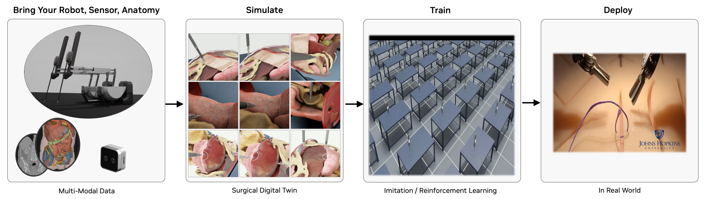

# 🔬 Robotic Surgery Workflow



---

## 🔬 Overview

The Robotic Surgery Workflow provides a robust framework for simulating, training, and analyzing robotic surgical procedures in a virtual environment. It leverages NVIDIA's [ray tracing](https://developer.nvidia.com/rtx/ray-tracing) capabilities to create highly realistic surgical simulations, enabling surgeons to practice complex procedures, researchers to develop new surgical techniques, and medical institutions to enhance their training programs. By offering a safe, controlled environment for surgical practice and research, this workflow helps improve surgical outcomes, reduce training costs, and advance the field of robotic surgery. The workflow is designed for healthcare professionals and researchers working in the field of robotic-assisted surgery.

### 🎯 Isaac Sim and Isaac Lab Integration

This workflow is built on [**NVIDIA Isaac Sim**](https://developer.nvidia.com/isaac/sim) and [**NVIDIA Isaac Lab**](https://isaac-sim.github.io/IsaacLab/main/index.html). When you run the workflow scripts, Isaac Sim/Lab provides:

- **🤖 Robot Physics**: Accurate dynamics simulation of surgical robots including joint mechanics and collision detection
- **📸 RTX Rendering**: Real-time ray tracing for photorealistic visualization of surgical scenes
- **🔧 Interactive Control**: Real-time robot manipulation through state machines, reinforcement learning, or direct control

The framework supports multiple surgical robots and tasks:

- [**Intuitive dVRK (da Vinci Research Kit)**](https://www.intuitive-foundation.org/dvrk/): Patient Side Manipulator (PSM) for minimally invasive surgery.
- [**Smart Tissue Autonomous Robot (STAR)**](https://www.nibib.nih.gov/news-events/newsroom/robot-performs-soft-tissue-surgery-minimal-human-help): Autonomous surgical robot for tissue manipulation.
- **Multi-arm coordination**: Dual-arm surgical robot synchronization.
- **Surgical task simulation**: Needle lifting, suturing, peg transfer, etc.

---

## 📋 Table of Contents

- [🔍 Requirements](#-requirements)
  - [GPU Architecture Requirements](#gpu-architecture-requirements)
  - [Driver & System Requirements](#driver--system-requirements)
  - [Software Requirements](#software-requirements)
- [🤖 Quick Start: State Machine Control with the da Vinci Research Kit (dVRK)](#-quick-start-state-machine-control-with-the-da-vinci-research-kit-dvrk)
- [🤖 Quick Start: Dual Arm Coordination](#quick-start-dual-arm-coordination)
- [🤖 Quick Start: STAR Robot Reach Task](#quick-start-star-robot-reach-task)
- [Guide: Surgical Task Simulations](#guide-surgical-task-simulations)
- [Guide: Train a dVRK PSM "Reach" Policy with Reinforcement Learning in Isaac Lab](#guide-train-a-dvrk-psm-reach-policy-with-reinforcement-learning-in-isaac-lab)
- [Guide: Headless & Streaming Mode](#guide-headless--streaming-mode)
- [Available User Modes](#available-user-modes)
- [Advanced Command Line Guide](#advanced-command-line-guide)
- [🔧 Additional Discussion](#-additional-discussion)
- [Troubleshooting](#troubleshooting)
- [📚 Citations](#-citations)

---

## 🔍 Requirements

### GPU Architecture Requirements

- **NVIDIA GPU**:
  - **Compute Capability**: ≥8.6 (Ampere or later)
  - **VRAM**: ≥24GB GDDR6/HBM
  - RT Core-enabled architecture for ray tracing
    - **Unsupported**: A100, H100 (lack RT Cores for ray tracing acceleration)

  ### 🔍 GPU Compatibility Verification

   ```bash
   nvidia-smi --query-gpu=name,compute_cap --format=csv,noheader
   ```

   Verify output shows compute capability ≥8.6.

### Driver & System Requirements

- **CPU Architecture**: x86_64
- **Operating System**: Ubuntu 22.04 LTS or 24.04 LTS
- **NVIDIA Driver**: ≥535.129.03 (RTX ray tracing API support)
- **Memory Requirements**: ≥8GB GPU memory, ≥32GB system RAM
- **Storage**: ≥100GB NVMe SSD (asset caching and simulation data)

  ### 🔍 Driver Version Validation

   ```bash
   nvidia-smi --query-gpu=driver_version --format=csv,noheader,nounits
   ```

### Software Requirements

- **Docker** with the [**NVIDIA Container Toolkit**](https://docs.nvidia.com/datacenter/cloud-native/container-toolkit/latest/install-guide.html) for GPU support

- Alternatively, you can use a **Conda** environment for local development. See [Conda Environment Setup discussion](#conda-environment-setup).

---

## 🤖 Quick Start: State Machine Control with the da Vinci Research Kit (dVRK)

Run the command below to build and launch an Isaac Lab scene with a dVRK Patient Side Manipulator (PSM) performing autonomous reaching using a GPU-accelerated state machine. The simulated PSM will move autonomously through predefined goal poses.

> [!NOTE]
> Please run the workflow as the root user when using the CLI.

```bash
./i4h run robotic_surgery reach_psm --as-root
```

> [!WARNING]
> **Initial Load Time**: The container may take 5-10 minutes to build on the first run. Isaac Sim may appear frozen during asset download and scene initialization with no console progress indication - this is normal behavior.

**What Happens in Isaac Sim:**

- **Scene Launch**: Isaac Sim opens a 3D virtual environment with a dVRK Patient Side Manipulator
- **State Machine Control**: The robot arm autonomously moves through predefined goal poses using a GPU-accelerated state machine
- **Visual Feedback**: Watch the PSM arm reach different positions in real-time with accurate joint mechanics and physics simulation

**How to Interact with Isaac Sim:**

- **Camera Control**: Use mouse to orbit, pan, and zoom around the surgical scene
- **Pause/Play**: Press spacebar to pause/resume the simulation
- **Inspect Objects**: Click on robot components (`Stage` -> `World` -> `envs` -> `env_0` -> `Robot`) to view properties and joint information

## Quick Start: Dual-Arm Coordination

Run the command below to view synchronized state machine control of two dVRK PSM arms in a single Isaac Lab scene.

```bash
./i4h run robotic_surgery reach_dual_psm --as-root
```

**What Happens in Isaac Lab:**

- **Dual-arm scene**: Isaac Lab loads two Patient Side Manipulators (left and right PSM) in a shared operating room environment.
- **Coordinated state machine**: Both arms follow a synchronized sequence of goal poses, illustrating multi-arm timing and workspace sharing.
- **Collision awareness**: Physics simulation handles two articulated robots; collision checking prevents self- and cross-arm interference.

**Features demonstrated:** Multi-robot setup, coordinated motion, dual-arm kinematics and collision detection.

**What you'll see:** Both PSM arms move through their reaching sequences in sync. Useful for validating bimanual surgical workflows and understanding how Isaac Lab manages multiple articulations in one scene.

## Quick Start: STAR Robot Reach Task

Run the command below to run the state machine reaching task with the Smart Tissue Autonomous Robot (STAR) in Isaac Lab. Compare with the dVRK PSM reach task discussed above.

```bash
./i4h run robotic_surgery reach_star --as-root
```

**What Happens in Isaac Lab:** Isaac Lab loads the STAR (Smart Tissue Autonomous Robot) model and a state machine drives the STAR arm through a reaching sequence.

**Features demonstrated:** STAR robot model, surgical arm kinematics, same state-machine and physics stack as dVRK PSM demos.

**What you'll see:** The STAR arm moves through its reaching sequence.

## Guide: Surgical Task Simulations

Run surgical manipulation tasks with increasing complexity. Each task uses a state machine to drive the robot through a defined sequence (e.g., approach, grasp, lift).

### Suture Needle Lifting

Run the command below to launch an Isaac Lab state machine simulation to lift a needle with the dVRK PSM robot arm. The arm moves to the needle, closes the gripper, and lifts the needle. Collision and contact response are visible as the jaws close on the needle and the needle moves with the end-effector.

```bash
./i4h run robotic_surgery lift_needle --as-root
```

**What Happens in Isaac Lab:** The dVRK PSM executes a needle-lifting routine: rest → approach above needle → approach → close gripper (grasp) → lift. Rigid-body physics simulates contact between the gripper jaws and the suture needle; the needle is constrained until grasped.

**Features demonstrated:** Grasping, rigid-body contact, state-machine-driven manipulation sequences.

### Needle Lifting with Organs in Operating Room

Run the command below to launch another Isaac Lab state machine simulation with the dVRK needle lift task, now applied in a more realistic operating room with organ models (e.g., liver, tissue). The arm moves to the needle, closes the gripper, and lifts the needle.

```bash
./i4h run robotic_surgery lift_needle_organs --as-root
```

**What Happens in Isaac Lab:** Same needle-lifting task as above, applied in a more realistic operating room with organ models (e.g., liver, tissue). The scene tests behavior in an anatomy-aware environment.

**Features demonstrated:** Scene complexity, organ assets, needle manipulation in a realistic OR layout.

**What you'll see:** An operating room ("OR") with organ meshes and the PSM performing the needle lift amid surrounding anatomy. Useful for assessing motion planning and collision avoidance in dense scenes.

### Peg Transfer Task

Run the command below to run a transfer task in Isaac Lab with the dVRK PSM robot arm controlled by a state machine. This is a standard surgical training task where the robot picks up a block and moves ("transfers") it to a goal position.

```bash
./i4h run robotic_surgery lift_block --as-root
```

**What Happens in Isaac Lab:** The PSM performs a peg-transfer-style task: approaching a block, grasping it, and transferring it (e.g., between pegs or zones).

**Features demonstrated:** Block manipulation, pick-and-place, precision positioning.

## Guide: Train a dVRK PSM "Reach" Policy with Reinforcement Learning in Isaac Lab

In this guide we train a policy to run the dVRK PSM "reach" task. The trained policy will generalize beyond the fixed states demonstrated in the earlier [Quick Start section](#-quick-start-state-machine-control-with-the-da-vinci-research-kit-dvrk), so that the dVRK PSM robot arm will "reach" toward any goal position provided.

 We use reinforcement learning with the [RSL-RL](https://github.com/leggedrobotics/rsl_rl) library to train the policy, letting Isaac Lab run many parallel simulation environments while a policy network learns from the reward signals (e.g., reaching goals, avoiding collisions).

> [!NOTE]
> Training in this guide typically takes 45 minutes or longer to complete.

### Run Reinforcement Learning

The following command launches GPU-based reinforcement learning for the "reach" task with Isaac Lab. Multiple Isaac Lab surgical scenes run headlessly in parallel on the GPU with randomized target poses. Over time the reinforcement learning algorithm refines the dVRK PSM robotic policy to minimize distance to target poses and maximize task reward.

> [!NOTE]
> Isaac Sim training instances run headlessly without display output. You will see console log output with episode rewards, step counts, and training metrics, without any visible Isaac Sim window.

```bash
./i4h run robotic_surgery train_rl --as-root
```

**What Happens in Isaac Lab (training):**

- **Algorithm and policy:** Training uses the [RSL-RL](https://github.com/leggedrobotics/rsl_rl) library with an **on-policy** algorithm (Proximal Policy Optimization, PPO). The policy is a neural network (actor) that maps observations (e.g., joint positions, goal pose) to robot actions (e.g., joint position or velocity targets). A separate critic network estimates value for the PPO update.
- **Parallel environments**: Multiple identical surgical scenes run in parallel on the GPU, each of which has a dVRK PSM simulated robot and goal position to reach. Target poses are sampled from uniform ranges (see the task's `UniformPoseCommandCfg` in `reach/config/psm/joint_pos_env_cfg.py`), so each env gets different goals over time and at reset.

### Evaluate the trained agent ("play mode")

The following command runs the dVRK PSM "reach" task with the trained policy in control. The policy autonomously receives observations (e.g., joint states, goal position) and outputs actions without human input.

```bash
./i4h run robotic_surgery play_rl --as-root
```

**What you'll see:** The PSM moves under the learned policy—reaching goals or performing the trained manipulation. Use this to judge success rate and behavior before deploying or collecting more data.

### Advanced Training and Play

The workflow training and play modes accept optional arguments (passed via `--run-args`). Use the optional parameters listed below to tune training to your platform and custom training scenarios.

```bash
# For complete help output
./i4h run robotic_surgery train_rl --as-root --run-args="--help"

# Available training arguments
./i4h run robotic_surgery train_rl --as-root --run-args="\
  [--task Isaac-Reach-PSM-v0] \
  [--headless] \
  [--num_envs 4096] \
  [--seed 42] \
  [--max_iterations 1500] \
  [--log_dir /workspace/i4h/logs/my_run] \
  [--video] \
  [--video_length 200] \
  [--video_interval 2000] \
  [--experiment_name my_experiment] \
  [--run_name my_run] \
  [--resume True] \
  [--load_run 2025-01-15_12-00-00] \
  [--checkpoint model_1000.pt] \
  [--logger tensorboard] \
  [--log_project_name my_project]"
```

## Guide: Headless & Streaming Mode

You can use Isaac Sim's WebRTC streaming support to run experiments remotely on systems without a display connected. Isaac Sim will render the scene on the server, which you can view and interact via a browser or the Isaac Sim WebRTC client.

**What Happens in Isaac Lab:** The simulation runs headless (no local GUI). A WebRTC server streams the viewport, and clients connect over the network to see the scene in real time.

**Features demonstrated:** Remote visualization, headless operation, WebRTC streaming for development or deployment on servers without a display.

### Network Requirements

Ensure ports `TCP/UDP 47995-48012`, `TCP/UDP 49000-49007`, and `TCP 49100` are open and reachable between the host running the workflow and your client machine.

### Remote Workstation for Headless Simulation

Run the dVRK PSM "reach" task on the remote system with the `--livestream` option:

```bash
./i4h run robotic_surgery reach_psm --as-root --run-args="--livestream 2"
```

### Local System with Display

Download, install, and run the [Isaac Sim WebRTC Client](https://docs.isaacsim.omniverse.nvidia.com/5.0.0/installation/download.html) for your local platform, then connect to the remote workstation. You will see the live server simulation of the dVRK PSM "reach" task displayed in the client window. Interaction with the scene such as camera controls may be limited depending on client support.

---

## Available User Modes

This workflow provides a variety of granular command line "modes" representing common tasks and scripts. Modes are organized by workflow category below.

### State Machine Demos

| Mode | Description | Optional `--run-args` |
| ---- | ----------- | -------------------- |
| `reach_psm` | Single-arm dVRK PSM reaching task (default) | `--headless`, `--livestream 2` |
| `reach_dual_psm` | Dual-arm dVRK PSM coordination | `--headless`, `--livestream 2` |
| `reach_star` | STAR robot reaching demonstration | `--headless`, `--livestream 2` |
| `lift_needle` | Suture needle lifting and manipulation | `--headless`, `--livestream 2` |
| `lift_needle_organs` | Needle lifting in realistic operating room with organs | `--headless`, `--livestream 2` |
| `lift_block` | Peg transfer block lifting task | `--headless`, `--livestream 2` |

### Reinforcement Learning

| Mode | Description | Optional `--run-args` |
| ---- | ----------- | -------------------- |
| `train_rl` | Train RL agent (default: PSM reach, headless) | `--task <task_name>` |
| `play_rl` | Evaluate trained RL agent | `--task <task_name>` |

**Available RL Tasks:**

- `Isaac-Reach-PSM-v0` / `Isaac-Reach-PSM-Play-v0` - PSM reaching (default)
- `Isaac-Lift-Needle-PSM-IK-Rel-v0` - Needle lifting with IK control

### Workflow Component Matrix

This workflow provides a variety of scripts used by the command line modes. Developers may choose to use these scripts via the CLI modes above, run these scripts directly, or use them as the baseline for custom development.

| Category | Script | Usage Scenario | Purpose | Documentation | Key Requirements | Expected Runtime |
| ---------- | -------- | ---------------- | --------- | --------------- | ------------------ | ------------------ |
| **🚀 Basic Control** | [reach_psm_sm.py](scripts/simulation/scripts/environments/state_machine/reach_psm_sm.py) | First-time users, basic robot control | Single-arm dVRK PSM reaching tasks | [State Machine README](scripts/simulation/scripts/environments/state_machine/README.md#dvrk-psm-reach) | Isaac Lab | 2-5 minutes |
| **🤖 Dual-Arm Control** | [reach_dual_psm_sm.py](scripts/simulation/scripts/environments/state_machine/reach_dual_psm_sm.py) | First-time users, basic robot control | Dual-arm dVRK PSM coordination | [State Machine README](scripts/simulation/scripts/environments/state_machine/README.md#dual-arm-dvrk-psm-reach) | Isaac Lab | 2-5 minutes |
| **⭐ STAR Robot** | [reach_star_sm.py](scripts/simulation/scripts/environments/state_machine/reach_star_sm.py) | First-time users, basic robot control | STAR robot reaching demonstrations | [State Machine README](scripts/simulation/scripts/environments/state_machine/README.md#star-reach) | Isaac Lab | 2-5 minutes |
| **🪡 Needle Manipulation** | [lift_needle_sm.py](scripts/simulation/scripts/environments/state_machine/lift_needle_sm.py) | First-time users, basic robot control | Suture needle lifting and manipulation | [State Machine README](scripts/simulation/scripts/environments/state_machine/README.md#suture-needle-lift) | Isaac Lab | 3-7 minutes |
| **🫁 Realistic OR Simulation** | [lift_needle_organs_sm.py](scripts/simulation/scripts/environments/state_machine/lift_needle_organs_sm.py) | Realistic surgical simulation in an operating room | Needle lifting | [State Machine README](scripts/simulation/scripts/environments/state_machine/README.md#organs-suture-needle-lift) | Isaac Lab | 3-7 minutes |
| **🧩 Peg Transfer** | [lift_block_sm.py](scripts/simulation/scripts/environments/state_machine/lift_block_sm.py) | First-time users, basic robot control | Peg transfer surgical training task | [State Machine README](scripts/simulation/scripts/environments/state_machine/README.md#peg-block-lift) | Isaac Lab | 2-5 minutes |
| **🧠 RL Training** | [train.py](scripts/simulation/scripts/reinforcement_learning/rsl_rl/train.py) | AI model development | Reinforcement learning agent training | [RSL-RL README](scripts/simulation/scripts/reinforcement_learning/rsl_rl/README.md#training-and-playing) | Isaac Lab | 45+ minutes |
| **🎮 RL Evaluation** | [play.py](scripts/simulation/scripts/reinforcement_learning/rsl_rl/play.py) | Model validation | Trained agent evaluation and visualization | [RSL-RL README](scripts/simulation/scripts/reinforcement_learning/rsl_rl/README.md#training-and-playing) | Isaac Lab, trained model | 5-10 minutes |
| **🎮 MIRA Teleoperation Tutorial** | [teleoperate_virtual_incision_mira.py](../telesurgery/docs/virtual_incision_mira/teleoperate_virtual_incision_mira.py) | Interactive robot control | Virtual Incision MIRA keyboard teleoperation | [Virtual Incision MIRA README](../telesurgery/docs/virtual_incision_mira/README.md) | Isaac Lab | 5-10 minutes |

---

## Advanced Command Line Guide

This workflow relies on the Isaac for Healthcare CLI (`./i4h`) for a simplified user experience. Read on for details on how advanced users might leverage custom CLI arguments to tailor the workflow to their needs.

### Passing Additional Parameters

The `--run-args` flag is used to pass additional arguments to the underlying Python command.

### Syntax

```bash
./i4h run robotic_surgery <mode> --as-root --run-args="<additional_arguments>"
```

**Note:**

- `--as-root` is required to run the command as root user.
- `--no-docker-build` can be used to skip the Docker container rebuild step when a container image has already been built. By default, the CLI triggers a Docker build on every `./i4h run` invocation. Use this flag to bypass the rebuild and may significantly accelerate the workflow startup time.

### Examples

```bash
# Simple flag
./i4h run robotic_surgery reach_psm --as-root --run-args="--headless"

# Flag with value
./i4h run robotic_surgery train_rl --as-root --run-args="--task Isaac-Lift-Needle-PSM-IK-Rel-v0"

# Multiple arguments
./i4h run robotic_surgery train_rl --as-root --run-args="--task Isaac-Reach-PSM-v0 --headless"
```

### Building Containers

```bash
# Build container without running
./i4h build-container robotic_surgery

# Build with no cache (force fresh build)
./i4h build-container robotic_surgery --no-cache
```

### Other Container Options

```bash
# Run in local mode (rebuild each time)
./i4h run robotic_surgery reach_psm --as-root --local

# Skip container rebuild (recommended for faster iteration)
./i4h run robotic_surgery reach_psm --as-root --no-docker-build

# Skip container rebuild (alternative using environment variable)
HOLOHUB_ALWAYS_BUILD=false ./i4h run robotic_surgery reach_psm --as-root

# View Docker build logs
./i4h run robotic_surgery reach_psm --as-root --dryrun
```

### Observed Environment Variables

| Variable | Description |
| -------- | ----------- |
| `HOLOHUB_ALWAYS_BUILD` | Set to `false` to skip container rebuild |
| `HOLOHUB_BUILD_LOCAL` | Set to `1` for local builds |

### CLI Reference

```bash
# Show all available modes for this workflow
./i4h modes robotic_surgery

# Show CLI help
./i4h run --help

# Dry run (show commands without executing)
./i4h run robotic_surgery reach_psm --as-root --dryrun

# Run with verbose output
./i4h run robotic_surgery reach_psm --as-root --verbose
```

---

## 🔧 Additional Discussion

### Understanding the Workflow Architecture

When you run workflow scripts, here's how they integrate with Isaac Sim:

```text
📦 Workflow Script Launch
    ↓
🚀 Isaac Sim Initialization
    ├── 🌍 World Creation (Physics Scene)
    ├── 🤖 Robot Loading (USD Assets)
    └── 🏥 Environment Setup (Operating Room)
    ↓
⚙️ Simulation Loop
    ├── 🧠 Control Logic (State Machine/RL Policy)
    ├── 🔄 Physics Step (Robot Dynamics)
    └── 🎯 Task Evaluation (Success Metrics)
```

**Core Isaac Sim Components:**

- **World**: The physics environment where all simulation occurs
- **Articulations**: Robot models with joints, links, and physics properties
- **Prims**: Individual objects in the scene (needles, tables, organs)
- **Controllers**: State machines, RL policies, or direct control interfaces

**Script-to-Simulation Flow:**

1. **Script Launch**: Python script imports Isaac Lab and initializes `SimulationApp`
2. **Scene Building**: Assets are loaded and positioned in 3D space
3. **Physics Setup**: Collision detection, dynamics, and material properties are configured
4. **Control Loop**: Script continuously sends commands to robots and receives feedback
5. **Visualization**: Isaac Sim renders the scene in real-time with RTX ray tracing

### Framework Architecture Dependencies

The robotic surgery workflow is built on the following dependencies:

- [IsaacSim 5.0.0](https://docs.isaacsim.omniverse.nvidia.com/5.0.0/index.html)
- [IsaacLab 2.3.0](https://isaac-sim.github.io/IsaacLab/release/2.3.0/index.html)
- [RSL-RL](https://github.com/leggedrobotics/rsl_rl) for reinforcement learning

### Docker Installation Procedures

Please refer to the [Robotic Surgery Docker Container Guide](./docker/README.md) for detailed instructions on how to run the workflow in a Docker container.

### NVIDIA Graphics Driver Installation

Install or upgrade to the latest NVIDIA driver from [NVIDIA website](https://www.nvidia.com/en-us/drivers/). The workflow requires driver version ≥535.129.03 for ray tracing capabilities.

### Conda Environment Setup

The robotic surgery workflow can be installed in a Conda-based environment for dependency isolation and compatibility. This path is optional if you prefer not to use Docker.

**Prerequisites**: [Miniconda](https://www.anaconda.com/docs/getting-started/miniconda/install) or Anaconda.

#### 1. Install Conda

Please refer to the [Miniconda Installation Guide](https://www.anaconda.com/docs/getting-started/miniconda/install#quickstart-install-instructions) to set up Conda on your system.

#### 2. Clone the Repository

```bash
git clone https://github.com/isaac-for-healthcare/i4h-workflows.git
cd i4h-workflows
```

#### 3. Set Up Your Conda Environment

```bash
conda create -n robotic_surgery python=3.11 -y
conda activate robotic_surgery
bash tools/env_setup_robot_surgery.sh
```

> [!WARNING]
> **Expected Build Time**: The environment setup process takes 40-60 minutes. You may encounter intermediary warnings about conflicting library dependencies - these are non-critical and can be ignored.

#### 4. Configure Your Host Environment

```bash
export PYTHONPATH=$(pwd)/workflows/robotic_surgery/scripts:$PYTHONPATH
```

Alternatively, add to your shell profile so variables are set automatically:

```bash
echo "export PYTHONPATH=$(pwd)/workflows/robotic_surgery/scripts:\$PYTHONPATH" >> ~/.bashrc
source ~/.bashrc
conda activate robotic_surgery
```

> [!TIP]
> If you have previously added other Isaac for Healthcare workflow scripts to your `PYTHONPATH`, reset to include only this workflow: `export PYTHONPATH=$(pwd)/workflows/robotic_surgery/scripts`.

If running on a system with multiple GPUs, optionally set which GPU to use:

```bash
export CUDA_VISIBLE_DEVICES=0  # Single GPU selection
```

---

## Troubleshooting

### Common Issues

### 1. Long Loading Times

**Symptoms**: Isaac Sim appears frozen during initial loading (5-10 minutes).

**Resolution**: This is expected behavior. Initial loading takes 5-10 minutes with no progress indication. Be patient and avoid force-closing the application. Subsequent runs are much faster.

### 2. GPU Not Detected

```text
No NVIDIA GPU detected
```

→ Ensure NVIDIA drivers are installed: `nvidia-smi`
→ Verify Docker has GPU support: `docker run --rm --gpus all nvidia/cuda:12.8.1-base-ubuntu24.04 nvidia-smi`
→ Verify VRAM ≥24GB: `nvidia-smi --query-gpu=memory.total --format=csv,noheader`

### 3. Container Build Fails

→ Try rebuilding with no cache: `./i4h build-container robotic_surgery --no-cache`
→ Ensure sufficient disk space (100GB+ recommended)
→ Check Docker daemon has enough resources

### 4. Module Import Errors

```text
ModuleNotFoundError: No module named 'simulation'
```

→ If using local Conda install, ensure: `export PYTHONPATH=$(pwd)/workflows/robotic_surgery/scripts`
→ The CLI automatically sets `PYTHONPATH` in the container - this should not happen when using `./i4h run`.

### 5. RL Training Out of Memory

→ Reduce the number of parallel environments in the task configuration
→ Try running with `--run-args="--headless"` to save GPU memory on rendering
→ Verify GPU meets the VRAM ≥24GB requirement

### 6. Dependency Warnings

While setting up your Conda environment, you may encounter intermediary warnings about conflicting library dependencies. These are non-critical and can be ignored.

### Hardware Requirements Validation

Verify your system meets the [Requirements](#-requirements) by running these commands:

```bash
# GPU name and compute capability
nvidia-smi --query-gpu=name,compute_cap --format=csv,noheader

# GPU memory
nvidia-smi --query-gpu=memory.total --format=csv,noheader

# NVIDIA driver version
nvidia-smi --query-gpu=driver_version --format=csv,noheader
```

### Getting Help

For detailed script options:

```bash
# Enter container interactively
./i4h run-container robotic_surgery --as-root

# Then check individual script help
python scripts/simulation/scripts/reinforcement_learning/rsl_rl/train.py --help
python scripts/simulation/scripts/reinforcement_learning/rsl_rl/play.py --help
```

For more information:

- [Main README](README.md) - Comprehensive workflow documentation
- [State Machine README](scripts/simulation/scripts/environments/state_machine/README.md) - State machine task details
- [RSL-RL README](scripts/simulation/scripts/reinforcement_learning/rsl_rl/README.md) - Reinforcement learning details
- [GitHub Issues](https://github.com/isaac-for-healthcare/i4h-workflows/issues) - Report bugs or request features

---

## 📚 Citations

This workflow originated from the [ORBIT-Surgical](https://orbit-surgical.github.io/) framework. If you use it in academic publications, please cite:

```text
@inproceedings{ORBIT-Surgical,
  author={Yu, Qinxi and Moghani, Masoud and Dharmarajan, Karthik and Schorp, Vincent and Panitch, William Chung-Ho and Liu, Jingzhou and Hari, Kush and Huang, Huang and Mittal, Mayank and Goldberg, Ken and Garg, Animesh},
  booktitle={2024 IEEE International Conference on Robotics and Automation (ICRA)},
  title={ORBIT-Surgical: An Open-Simulation Framework for Learning Surgical Augmented Dexterity},
  year={2024},
  pages={15509-15516},
  doi={10.1109/ICRA57147.2024.10611637}
}

@inproceedings{SuFIA-BC,
  author={Moghani, Masoud and Nelson, Nigel and Ghanem, Mohamed and Diaz-Pinto, Andres and Hari, Kush and Azizian, Mahdi and Goldberg, Ken and Huver, Sean and Garg, Animesh},
  booktitle={2025 IEEE International Conference on Robotics and Automation (ICRA)},
  title={SuFIA-BC: Generating High Quality Demonstration Data for Visuomotor Policy Learning in Surgical Subtasks},
  year={2025},
}
```
