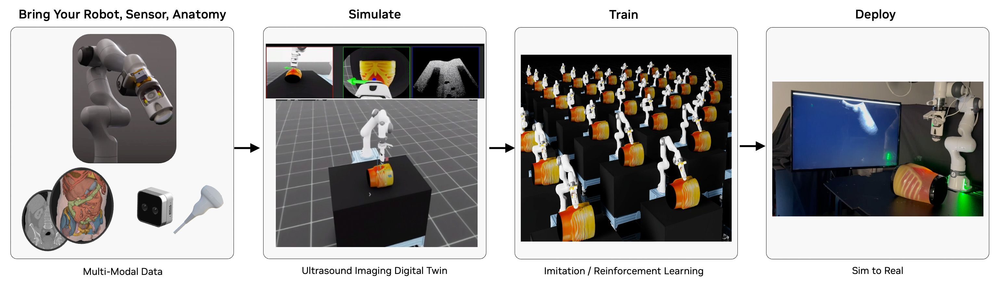

# 🤖 Robotic Ultrasound Workflow



---

## 🔬 Overview

The Robotic Ultrasound Workflow provides a robust framework for simulating, training, and deploying robotic ultrasound systems using NVIDIA's advanced ray tracing technology. By offering a physics-accurate ultrasound simulation environment, it enables researchers to develop and validate autonomous scanning protocols, train AI models for image interpretation, and accelerate the development of next-generation ultrasound systems without requiring physical deployment hardware. The workflow is designed for healthcare professionals, medical imaging researchers, and ultrasound device manufacturers working in the field of autonomous ultrasound imaging.

The workflow features a state-of-the-art ultrasound sensor simulation that leverages GPU-accelerated ray tracing to model the complex physics of ultrasound wave propagation. The simulator accurately represents:

- Acoustic wave propagation through different tissue types
- Tissue-specific acoustic properties (impedance, attenuation, scattering)
- Real-time B-mode image generation based on echo signals
- Dynamic tissue deformation and movement
- Multi-frequency transducer capabilities

This physics-based approach enables the generation of highly realistic synthetic ultrasound images that closely match real-world data, making it ideal for training AI models and validating autonomous scanning algorithms. The workflow supports multiple AI policies (PI0, GR00T N1) and can be deployed using NVIDIA Holoscan for clinical applications, providing a complete pipeline from simulation to real-world deployment.

### 🎯 Isaac Sim and Isaac Lab Integration

This workflow is built on **NVIDIA Isaac Sim** and **NVIDIA Isaac Lab**. When you run the workflow scripts, Isaac Sim/Lab provides:

- **🤖 Robot Physics**: Accurate Franka arm dynamics with precise end-effector control for ultrasound probe manipulation
- **🔧 Real-Time Control**: Live robot control through AI policies, teleoperation, or automated scanning protocols
- **📊 Sensor Integration**: Multi-modal data streams including RGB cameras, depth sensing, and ultrasound B-mode imaging

---

## 📋 Table of Contents

- [🔍 Requirements](#-requirements)
  - [GPU Architecture Requirements](#gpu-architecture-requirements)
  - [Driver & System Requirements](#driver--system-requirements)
  - [Software Requirements](#software-requirements)
  - [RTI Connext DDS Prerequisites](#rti-connext-dds-prerequisites)
- [🤖 Quick Start: Run Pi0 Policy-Based Control with Ultrasound Ray-Tracing Simulation](#-quick-start-run-pi0-policy-based-control-with-ultrasound-ray-tracing-simulation)
- [🎮 Guide: Collect Training Data](#-guide-collect-training-data)
- [Guide: Fine-Tune a Robotic Policy](#guide-fine-tune-a-robotic-policy)
- [Guide: Simulation with Real Hardware In The Loop](#guide-simulation-with-real-hardware-in-the-loop)
- [Available User Modes](#available-user-modes)
- [Advanced Command Line Guide](#advanced-command-line-guide)
- [🔧 Additional Discussion](#-additional-discussion)
- [Troubleshooting](#troubleshooting)

---

## 🔍 Requirements

### GPU Architecture Requirements

- **NVIDIA GPU**:
  - **Compute Capability**: ≥8.6 (Ampere or later)
  - RT Core-enabled architecture for ray tracing
    - **Unsupported**: A100, H100 (lack RT Cores for ray tracing acceleration)
  - **VRAM**: ≥24GB GDDR6/HBM for inference and simulation, ≥48GB for fine-tuning (optional)

  ### 🔍 GPU Compatibility Verification

   ```bash
   nvidia-smi --query-gpu=name,compute_cap --format=csv,noheader
   ```

   Verify output shows compute capability ≥8.6.

### Driver & System Requirements

- **CPU Architecture**: x86_64
- **Operating System**: Ubuntu 22.04 LTS or 24.04 LTS
- **NVIDIA Driver**: ≥555.x (RTX ray tracing API support)
- **CUDA Toolkit**: ≥12.6 (OptiX 8.x compatibility) but < 13.0
- **Memory Requirements**: ≥64GB system RAM
- **Storage**: ≥100GB NVMe SSD (asset caching and model downloading)

  ### 🔍 Driver Version Validation

   ```bash
   nvidia-smi --query-gpu=driver_version --format=csv,noheader,nounits
   ```

  ### 🔍 CUDA Toolkit Verification

   ```bash
   nvcc --version | grep "release" | awk '{print $6}' | cut -d',' -f1
   ```

### Software Requirements

- **Operating System**: Ubuntu 22.04 or Ubuntu 24.04 LTS
- **NVIDIA Driver**: ≥535.0
- **Docker** with the [**NVIDIA Container Toolkit**](https://docs.nvidia.com/datacenter/cloud-native/container-toolkit/latest/install-guide.html) for GPU support

### RTI Connext DDS Prerequisites

This workflow uses [RTI Connext](https://content.rti.com/l/983311/2025-07-08/q5x1n8) for Data Distribution Service (DDS) inter-process communication. Visit the [RTI Connext Express registration page](https://content.rti.com/l/983311/2025-07-25/q6729c) to obtain an evaluation license. Please find additional information on Isaac for Healthcare with RTI Connext at [https://www.rti.com/products/third-party-integrations/nvidia](https://www.rti.com/products/third-party-integrations/nvidia).

**RTI Connext DDS Multicast Discovery:** Please open ports 7400 and 7401 in your firewall to enable RTI DDS multicast to and from the static IPv4 `239.255.0.1`. Refer to [RTI Connext DDS documentation](https://community.rti.com/content/forum-topic/statically-configure-firewall-let-omg-dds-traffic-through) for details.

```bash
sudo ufw allow in proto udp to 239.255.0.1 port 7400:7401
sudo ufw allow out proto udp to 239.255.0.1 port 7400:7401
```

## 🤖 Quick Start: Run Pi0 Policy-Based Control with Ultrasound Ray-Tracing Simulation

In this guide we run the [Isaac Lab](https://developer.nvidia.com/isaac/lab) scene, [Pi0 (π₀) robotic policy](https://www.pi.website/blog/pi0), and [DearPyGUI](https://github.com/hoffstadt/DearPyGui) visualization together in a Docker container. The simulated Franka robot arm will execute the trained ultrasound scanning task on the simulated liver phantom asset and transmit the ultrasound ray-traced probe image stream over DDS to the visualization window in real time.

> [!NOTE]
> Please run the workflow as the root user to avoid Isaac Sim and Isaac Lab permissions errors.

```bash
./i4h run robotic_ultrasound full_pipeline --as-root
```

> [!WARNING]
> ⏳ **Initial Load Time**: The container may take 10 minutes or longer to build on the first run. Subsequent runs may require 2 minutes or longer to initialize Isaac Lab.
> During the initialization period the Isaac Lab window may appear to be unresponsive.

**What Happens in Isaac Sim:**

- **🏥 Medical Scene**: Isaac Sim creates a space with Franka robotic arm positioned next to a hospital bed with patient model
- **🧠 AI Policy Control**: Gr00t or PI0 neural network processes real-time visual input to autonomously control ultrasound scanning motions
- **🩻 Live Ultrasound Feedback**: In a separate visualization window, Real-time B-mode images update as the probe scan through different anatomical regions
- **📡 DDS Communication**: Real-time data exchange between AI policy and robot simulation via distributed messaging
- **📸 Multi-Camera Setup**: Multiple RGB cameras provide different viewpoints of the scanning procedure

**How to Interact with Isaac Sim:**

- **🖱️ Scene Navigation**: Use mouse controls to orbit around the phantom and robot for different viewing angles
- **⏸️ Simulation Control**: Spacebar to pause/resume the autonomous scanning sequence
- **📊 Real-Time Monitoring**: Observe robot joint states, camera feeds, and policy decisions in the GUI
- **🔍 Component Inspection**: Click on robot links (under `Stage` -> `World` -> `envs` -> `env_0` -> `Robot`) to view detailed properties

### Alternative: Run In Separate Containers

By default the workflow runs three dedicated processes together in one container.
Developers may choose to run the processes in separate containers within the host workstation environment for purposes of testing and inspection.

Terminal 1 - Simulation:

```bash
./i4h run robotic_ultrasound sim_env --as-root
```

Terminal 2 - Policy:

```bash
./i4h run robotic_ultrasound pi0_policy --as-root
```

Terminal 3 - Visualization:

```bash
./i4h run robotic_ultrasound visualization --as-root
```

When each process has initialized, you will see the Franka robot execute the trained robot task with ultrasound image results displayed in the DearPyGUI window.

## 🎮 Guide: Collect Training Data

In this guide we run the [Isaac Lab](https://developer.nvidia.com/isaac/lab) scene with the goal of collecting episodes to later train a robotic policy.
We can collect data by either manually teleoperating the robotic probe in real time, or by directing the probe to pre-defined locations via state machine input.

### 🎮 Manual Teleoperation

This section discusses how to interactively control the simulated Franka robot. You can use this mode for data collection or manual scanning practice.

Run the following command to launch the Isaac Sim scene and teleoperate with your keyboard. Add the optional "--run-args" below to record and save results
as a teleoperation episode in an HDF5 file for later playback or training.

```bash
./i4h run robotic_ultrasound teleop_with_ultrasound --as-root \
  [--run-args="--record --dataset_path=/workflows/i4h/data/robotic_ultrasound/manual_scan.hdf5"]
```

> [!TIP]
> Use Ctrl+C to halt recording and exit the application.

**Alternative (Basic Teleoperation Without Ultrasound):**

Ultrasound ray-tracing simulation is enabled by default. Run the alternate mode below to teleoperate without any ray-tracing simulation.

```bash
./i4h run robotic_ultrasound teleop_keyboard --as-root
```

**What Happens in Isaac Sim:**

- **🎮 Manual Control**: Direct 6-DOF (position + orientation) control of the ultrasound probe via keyboard, SpaceMouse, or gamepad
- **🩻 Live Ultrasound Feedback (optional)**: Real-time B-mode images update as you manually scan different anatomical regions
- **📸 Multi-Camera Views**: Observe your scanning technique from multiple camera perspectives simultaneously
- **🔧 Interactive Physics**: Feel realistic probe-to-phantom contact detection and constraints during manual scanning

**Isaac Sim Control Features:**

- **⌨️ Keyboard Mapping**: Reference [Teleoperation Documentation](./scripts/simulation/environments/teleoperation/README.md#keyboard-controls)
- **🖱️ 3D Mouse Support**: Direct SE(3) control for intuitive ultrasound probe manipulation
- **📊 Real-Time Feedback**: Live visualization of probe position, camera feed, and ultrasound image

### 📋 State Machine Automatic Data Collection

For consistent results we can define a Isaac Lab state machine directing the Franka arm on how to move between fixed collection points.
This workflow provides a sample, pre-defined state machine routine. Run the following command to automatically collect sample data
with the demo state machine.

```bash
./i4h run robotic_ultrasound state_machine_scan --as-root \
  --run-args="--num_episodes [10]"
```

Data will be saved in the `data/hdf5/<timestamp_and_task_name>` folder.

> [!TIP]
> Adjust the number of episodes as desired.

### Replay Recorded Data

It may be useful to play back training recordings to ensure data quality. Run the following command with the path to your saved HDF5 file to view
each training episode. Note that the `i4h-workflows` folder is mounted in the container at `/workspace/i4h`.

```bash
./i4h run robotic_ultrasound replay --as-root \
  --run-args="data/hdf5/<timestamp_and_task_name>/data_0.hdf5 --enable_cameras"
```

## Guide: Fine-Tune a Robotic Policy

In this guide we use our collected training episodes to fine-tune a robotic policy for the Isaac Lab ultrasound scanning task.

> [!NOTE]
> Policy training requires additional GPU memory. Please refer to [workflow requirements](#-requirements) for details.

### Prepare Training Data

Convert Isaac Lab episodes from HDF5 format to the required LeRobot data format.

```bash
# Convert HDF5 to LeRobot format
./i4h run robotic_ultrasound convert_hdf5 --as-root \
  --run-args="--repo_id=<my_ultrasound_dataset> \
    --task_prompt='Perform liver ultrasound scan' \
    </workspace/i4h/folder-containing-hdf5-files> "
```

### Option 1: Train a Pi0 policy

Run the following command to fine-tune a robotic policy based on the Pi0 model.

```bash
# Train PI0 model
./i4h run robotic_ultrasound train_pi0 --as-root \
  --run-args="--config=robotic_ultrasound_lora \
  --exp_name=liver_ultrasound \
  --repo_id=<my_ultrasound_dataset>"
```

### Option 2: Train a GR00T N1 policy

Run the following command to fine-tune a robotic policy based on the GR00T N1 model.

```bash
# Train GR00T N1 model
./i4h run robotic_ultrasound train_gr00tn1 --as-root \
  --run-args="--dataset_path=</workspace/i4h/data/lerobot_dataset> \
  --output_dir=</workspace/i4h/data/checkpoints> \
  [--num_epochs=100]"
```

### Evaluate the Fine-Tuned Policy

Once training is complete, run the following to compare predicted trajectories against ground truth.

```bash
./i4h run robotic_ultrasound evaluate --as-root \
  --run-args="--predicted_path=</workspace/i4h/data/predicted.hdf5> \
    --ground_truth_path=</workspace/i4h/data/ground_truth.hdf5>"
```

This mode runs the [evaluate_trajectories](scripts/simulation/evaluation/evaluate_trajectories.py) script to perform the following:

1. **Loads Data**: Reads ground truth trajectories from HDF5 files and predicted trajectories from `.npz` files based on configured file patterns.
2. **Computes Metrics**: For each episode and each prediction source, it calculates:
    - **Success Rate**: The percentage of ground truth points that are within a specified radius of any point in the predicted trajectory.
    - **Average Minimum Distance**: The average distance from each ground truth point to its nearest neighbor in the predicted trajectory.
3. **Generates Plots and Outputs**:
    - Console output summarizing progress and final average metrics per method.
    - Individual 3D trajectory plots comparing the ground truth and a specific prediction for each episode.
    - A summary plot showing the mean success rate versus different radius, including 95% confidence intervals, comparing all configured prediction methods.

Please refer to the [evaluation module](scripts/simulation/evaluation) for more information.

## Guide: Simulation with Real Hardware In The Loop

Users with Clarius or Intel Realsense hardware can leverage Holoscan SDK integration to publish sensor images in real time over DDS.
These modes can be used in coordination with the Isaac Lab simulated probe positioning along with the DearPyGUI visualizer application
in place of ultrasound ray tracing simulation for training data collection.

Follow the guidance below to run the Isaac Sim and visualization applications with your real probe or camera hardware. You will see the
real image stream reflected in the visualization window.

### Run the Isaac Sim and Visualizer Without Ray Tracing

Run the following in separate terminals to start the Isaac Sim Franka robot scene and the standalone DearPyGUI visualizer application:

**Terminal 1**: Launch simulation environment

```bash
./i4h run robotic_ultrasound sim_env --as-root
```

**Terminal 2**: Launch visualization window

```bash
./i4h run robotic_ultrasound visualizer --as-root
```

### Run with Clarius Cast Ultrasound Probe Hardware

Connect the Clarius Cast probe to your workstation, then run:

```bash
# Clarius Cast ultrasound probe
./i4h run robotic_ultrasound clarius_cast --as-root \
  --run-args="--config=scripts/holoscan_apps/clarius_cast/config.yaml"
```

### Run with Clarius Solum Ultrasound Probe Hardware

Connect the Clarius Solum probe to your workstation, then run:

```bash
# Clarius Solum ultrasound probe
./i4h run robotic_ultrasound clarius_solum --as-root \
  --run-args="--config=scripts/holoscan_apps/clarius_solum/config.yaml"
```

### Run with Intel RealSense Depth Camera Hardware

Connect the Intel RealSense camera to your workstation, then run:

```bash
# Intel RealSense depth camera
./i4h run robotic_ultrasound realsense --as-root \
  --run-args="--config=scripts/holoscan_apps/realsense/config.yaml"
```

## Available User Modes

This workflow provides a variety of granular command line "modes" representing common tasks and scripts.
Modes are organized by workflow category below.

### Policy Inference & Deployment

| Mode | Description | Optional `--run-args` |
| ---- | ----------- | -------------------- |
| `policy_with_sim` | Run PI0 policy with simulation (recommended for quick start) | None |
| `gr00tn1_with_sim` | Run GR00T N1 policy with simulation | None |
| `full_pipeline` | Complete pipeline with policy, sim, ultrasound, visualization | None |
| `pi0_policy` | Run PI0 policy only (for debugging, requires `sim_env` running) | Override: `--ckpt_path=/path` |
| `gr00tn1_policy` | Run GR00T N1 policy only (for debugging, requires `sim_env` running) | Override: `--ckpt_path=/path` |
| `sim_env` | Launch Isaac Sim with DDS only (for debugging) | None |

### Interactive Control

| Mode | Description | Optional `--run-args` |
| ---- | ----------- | -------------------- |
| `teleop_keyboard` | Manual control via keyboard | `--record --dataset_path=/path` |
| `teleop_with_ultrasound` | Manual control + ultrasound imaging + visualization | `--record --dataset_path=/path` |

### Simulation & Ultrasound

| Mode | Description | Optional `--run-args` |
| ---- | ----------- | -------------------- |
| `state_machine_scan` | Automated liver scanning protocol | None |
| `replay` | Replay recorded trajectories | `/path/to/recording.hdf5 --enable_cameras` |
| `visualization` | Real-time camera and ultrasound display | None |

### Training & Data

| Mode | Description | Required `--run-args` |
| ---- | ----------- | -------------------- |
| `convert_hdf5` | Convert HDF5 to LeRobot format | `--repo_id=name --hdf5_path=/path --task_description="..."` |
| `train_pi0` | Train PI0 imitation learning model | `--dataset_path=/path --output_dir=/path` |
| `train_gr00tn1` | Train GR00T N1 foundation model | `--dataset_path=/path --output_dir=/path` |
| `evaluate` | Evaluate policy trajectories | `--predicted_path=/path --ground_truth_path=/path` |

### Hardware Integration

| Mode | Description | Required `--run-args` |
| ---- | ----------- | -------------------- |
| `clarius_cast` | Clarius Cast probe integration | `--config=/path/to/config.yaml` |
| `clarius_solum` | Clarius Solum probe integration | `--config=/path/to/config.yaml` |
| `realsense` | Intel RealSense depth camera | `--config=/path/to/config.yaml` |

### Workflow Component Matrix

This workflow provides a variety of scripts used by the command line modes. Developers may choose to use these scripts via the CLI modes diescussed above, run these scripts directly, or use them as the baseline for custom development.

| Category | Script | Usage Scenario | Purpose | Documentation | Key Requirements | Expected Runtime |
| ---------- | -------- | ---------------- | --------- | --------------- | ------------------ | ------------------ |
| **🚀 Quick Start** | [simulation/imitation_learning/pi0_policy/eval.py](scripts/simulation/imitation_learning/pi0_policy/eval.py) | First-time users, policy testing | PI0 policy evaluation | [Simulation README](./scripts/simulation/imitation_learning/README.md) | PI0 policy, Isaac Sim | 2-5 minutes |
| **🔄 Multi-Component** | [simulation/environments/sim_with_dds.py](scripts/simulation/environments/sim_with_dds.py) | Full pipeline testing | Main simulation with DDS communication | [Simulation README](./scripts/simulation/environments/README.md#simulation-with-dds) | Isaac Sim, DDS | Continuous |
| **🎮 Interactive Control** | [simulation/environments/teleoperation/teleop_se3_agent.py](scripts/simulation/environments/teleoperation/teleop_se3_agent.py) | Manual control, data collection | Manual robot control via keyboard/gamepad | [Simulation README](./scripts/simulation/environments/teleoperation/README.md) | Isaac Sim, input device | Continuous |
| **🩺 Ultrasound Simulation** | [simulation/examples/ultrasound_raytracing.py](scripts/simulation/examples/ultrasound_raytracing.py) | Realistic ultrasound imaging | Physics-based ultrasound image generation | [Simulation README](scripts/simulation/examples/README.md) | RayTracing Simulator | Continuous |
| **🤖 Policy Inference** | [policy/run_policy.py](scripts/policy/run_policy.py) | Policy deployment | Generic policy runner for PI0 and GR00T N1 models | [Policy Runner README](scripts/policy/README.md) | Model inference, DDS | Continuous |
| **🧠 Policy Training** | [training/pi_zero/train.py](scripts/training/pi_zero/train.py) | Model development | Train PI0 imitation learning models | [PI0 Training README](scripts/training/pi_zero/README.md) | Training data, GPU | Depends on the dataset size |
| **🧠 Policy Training** | [training/gr00t_n1/train.py](scripts/training/gr00t_n1/train.py) | Advanced model development | Train GR00T N1 foundation models | [GR00T N1 Training README](scripts/training/gr00t_n1/README.md) | Training data, GPU | Depends on the dataset size |
| **🔄 Data Processing** | [training/convert_hdf5_to_lerobot.py](scripts/training/convert_hdf5_to_lerobot.py) | Data preprocessing | Convert HDF5 data to LeRobot format | [GR00T N1 Training README](scripts/training/gr00t_n1/README.md#data-conversion) | HDF5 files | Depends on the dataset size |
| **📈 Evaluation** | [simulation/evaluation/evaluate_trajectories.py](scripts/simulation/evaluation/evaluate_trajectories.py) | Performance analysis | Compare predicted vs ground truth trajectories | [Evaluation README](scripts/simulation/evaluation/README.md) | Trajectory data | Depends on the dataset size |
| **🏗️ State Machine** | [simulation/environments/state_machine/liver_scan_sm.py](scripts/simulation/environments/state_machine/liver_scan_sm.py) | Automated data collection | Automated liver scanning protocol | [Simulation README](scripts/simulation/environments/state_machine/README.md) | Isaac Sim | 5-15 minutes |
| **🗂️ Data Collection** | [simulation/environments/state_machine/liver_scan_sm.py](scripts/simulation/environments/state_machine/liver_scan_sm.py) | Automated data collection | Automated liver scanning protocol | [Simulation README](scripts/simulation/environments/state_machine/README.md) | Isaac Sim | 5-15 minutes |
| **🔄 Replay** | [simulation/environments/state_machine/replay_recording.py](scripts/simulation/environments/state_machine/replay_recording.py) | Data validation | Replay recorded robot trajectories | [Simulation README](scripts/simulation/environments/state_machine/README.md#replay-recordings) | Recording files | 2-5 minutes |
| **📊 Visualization** | [utils/visualization.py](scripts/utils/visualization.py) | Monitoring simulations, debugging | Real-time camera feeds and ultrasound display | [Utils README](./scripts/utils/README.md) | DDS, GUI | Continuous |
| **🏥 Hardware-in-the-loop** | [holoscan_apps/clarius_cast/clarius_cast.py](scripts/holoscan_apps/clarius_cast/clarius_cast.py) | Hardware-in-the-loop | Clarius Cast ultrasound probe integration | [Holoscan Apps README](scripts/holoscan_apps/README.md) | Clarius probe, Holoscan | Continuous |
| **🏥 Hardware-in-the-loop** | [holoscan_apps/clarius_solum/clarius_solum.py](scripts/holoscan_apps/clarius_solum/clarius_solum.py) | Hardware-in-the-loop | Clarius Solum ultrasound probe integration | [Holoscan Apps README](scripts/holoscan_apps/README.md) | Clarius probe, Holoscan | Continuous |
| **🏥 Hardware-in-the-loop** | [holoscan_apps/realsense/camera.py](scripts/holoscan_apps/realsense/camera.py) | Hardware-in-the-loop | RealSense depth camera integration | [Holoscan Apps README](scripts/holoscan_apps/README.md) | RealSense camera, Holoscan | Continuous |
| **📡 Communication** | [dds/publisher.py](scripts/dds/publisher.py) | Data streaming | DDS data publishing utilities | [DDS README](scripts/dds/README.md) | DDS license | Continuous |
| **📡 Communication** | [dds/subscriber.py](scripts/dds/subscriber.py) | Data reception | DDS data subscription utilities | [DDS README](scripts/dds/README.md) | DDS license | Continuous |

---

## Advanced Command Line Guide

This workflow relies on the Isaac for Healthcare CLI (`./i4h`) for a simplified user experience.
Read on for details on how advanced users might leverage custom CLI arguments to tailor the workflow to their needs.

### Passing Additional Parameters

The `--run-args` flag is used to pass additional arguments to the underlying Python command.

### Syntax

```bash
./i4h run robotic_ultrasound <mode> --run-args="<additional_arguments>"
```

**Note:**

- `--as-root` is required to run the command as root user.
- `--no-docker-build` can be used to skip the Docker container rebuild step when a container image has already been built.
  By default, the CLI triggers a Docker build on every `./i4h run` invocation. Use this flag to bypass the rebuild and may significantly accelerate the workflow startup time.

### Examples

```bash
# Simple flag
./i4h run robotic_ultrasound teleop_keyboard --as-root --run-args="--record"

# Flag with value
./i4h run robotic_ultrasound pi0_policy --as-root --run-args="--ckpt_path=/custom/checkpoint"

# Multiple arguments
./i4h run robotic_ultrasound state_machine_scan --as-root --run-args="--num_episodes 2 --include_seg"

# Positional argument
./i4h run robotic_ultrasound replay --as-root --run-args="/data/recording.hdf5"
```

### Building Containers

```bash
# Build container without running (x86_64 default)
./i4h build-container robotic_ultrasound

# Build with no cache (force fresh build)
./i4h build-container robotic_ultrasound --no-cache
```

### Other Container Options

```bash
# Run in local mode (rebuild each time)
./i4h run robotic_ultrasound pi0_policy --as-root --local

# Skip container rebuild (recommended for faster iteration)
./i4h run robotic_ultrasound pi0_policy --as-root --no-docker-build

# Skip container rebuild (alternative using environment variable)
HOLOHUB_ALWAYS_BUILD=false ./i4h run robotic_ultrasound pi0_policy --as-root

# View Docker build logs
./i4h run robotic_ultrasound pi0_policy --as-root --dryrun
```

### Observed Environment Variables

| Variable | Description |
| -------- | ----------- |
| `RTI_LICENSE_FILE` | Path to RTI DDS license file |
| `RTI_LICENSE_URL` | URL for RTI license download (used when RTI_LICENSE_FILE is not set) |
| `HOLOHUB_ALWAYS_BUILD` | Set to `false` to skip container rebuild |
| `HOLOHUB_BUILD_LOCAL` | Set to `1` for local builds |

### CLI Reference

```bash
# Show all available modes for this workflow
./i4h modes robotic_ultrasound

# Show CLI help
./i4h run --help

# Dry run (show commands without executing)
./i4h run robotic_ultrasound pi0_policy --as-root --dryrun

# Run with verbose output
./i4h run robotic_ultrasound pi0_policy --as-root --verbose
```

## 🔧 Additional Discussion

### 🎓 Understanding the Isaac Sim Workflow Architecture

When you run robotic ultrasound workflow scripts, here's how they integrate with Isaac Sim:

```text
📦 Workflow Script Launch
    ↓
🚀 Isaac Sim Initialization
    ├── 🌍 Medical Scene Creation (Patient Room)
    ├── 🤖 Franka Robot Loading (7-DOF Arm + Ultrasound Probe)
    ├── 🏥 Environment Setup (Hospital Bed, Patient Model)
    └── 📸 Sensor Configuration (RGB Cameras, Ultrasound Transducer)
    ↓
⚙️ Simulation Loop
    ├── 🧠 Control Logic (AI Policy/Teleoperation/State Machine)
    ├── 🔄 Physics Step (Robot Dynamics + Phantom Scanning)
    ├── 🩻 Ultrasound Ray Tracing (Acoustic Wave Simulation)
    ├── 📊 Sensor Updates (Camera Feeds + B-Mode Images)
    └── 📡 DDS Communication (Real-Time Data Streaming)
```

**Core Isaac Sim Components for Ultrasound:**

- **🌍 World**: Medical environment with realistic patient room and equipment
- **🤖 Franka Articulation**: 7-DOF robotic arm with precise end-effector control
- **🩻 Ultrasound Simulator**: GPU-accelerated acoustic ray tracing for B-mode image generation
- **📸 Multi-Camera System**: RGB and depth cameras for visual feedback and policy input
- **📡 DDS Integration**: Real-time communication between simulation and AI policies
- **🔧 Interactive Controls**: Teleoperation interfaces for manual probe control

**Script-to-Simulation Flow:**

1. **Isaac Sim Launch**: Python script initializes simulation app with medical environment
2. **Robot & Patient Setup**: Franka arm, ultrasound probe, and patient anatomy are loaded
3. **Sensor Configuration**: Cameras and ultrasound transducer are positioned and calibrated
4. **Control Mode Selection**: AI policy, teleoperation, or automated scanning is activated
5. **Real-Time Loop**: Robot moves probe, ultrasound images generate, data streams via DDS
6. **Visualization**: Multi-modal rendering shows robot motion, phantom scanning, and ultrasound images

### 🏗️ Framework Architecture Dependencies

The robotic ultrasound workflow is built on the following dependencies:

- [IsaacSim 4.5.0](https://docs.isaacsim.omniverse.nvidia.com/4.5.0/index.html)
- [IsaacLab 2.1.0](https://isaac-sim.github.io/IsaacLab/v2.1.0/index.html)
- [Gr00T N1](https://github.com/NVIDIA/Isaac-GR00T)
- [Cosmos Transfer](https://research.nvidia.com/labs/dir/cosmos-transfer1/)
- [openpi](https://github.com/Physical-Intelligence/openpi)
- [lerobot](https://github.com/huggingface/lerobot)
- [Raytracing Ultrasound Simulator](https://github.com/isaac-for-healthcare/i4h-sensor-simulation/tree/v0.3.0/ultrasound-raytracing)
- [RTI Connext DDS](https://www.rti.com/products)

### 🐳 Docker Installation Procedures

Please refer to the [Robotic Ultrasound Docker Container Guide](./docker/README.md) for detailed instructions on how to run the workflow in a Docker container.

### NVIDIA Graphics Driver Installation

Install or upgrade to the latest NVIDIA driver from [NVIDIA website](https://www.nvidia.com/en-us/drivers/)

### 2️⃣ CUDA Toolkit Installation

Follow the [NVIDIA CUDA Quick Start Guide](https://docs.nvidia.com/cuda/cuda-quick-start-guide/index.html)

### RTI DDS License Configuration

1. Obtain a license/activation key from the [RTI Connext Express registration page](https://content.rti.com/l/983311/2025-07-25/q6729c)
2. Configure environment variable:

```bash
# Pre-downloaded license file on the host system
export RTI_LICENSE_FILE=/path/to/your/rti_license.dat

# Or, URL to retrieve a new evaluation license
export RTI_LICENSE_URL="https://content.rti.com/l/983311/2025-07-25/q6729c"
```

> [!NOTE]
> **Dependency Conflict Resolution:** Expected PyTorch version conflicts between IsaacLab (2.5.1) and OpenPI (2.6.0) are non-critical and can be ignored.

#### Model Management

There are two models in the workflow available on Hugging Face:

- [GR00T N1 with Cosmos](https://huggingface.co/nvidia/Liver_Scan_Gr00t_Cosmos_Rel)
- [Pi0 with Cosmos](https://huggingface.co/nvidia/Liver_Scan_Pi0_Cosmos_Rel)

Model retrieval is done automatically when running the workflow. You can also download the models manually from Hugging Face.

## Troubleshooting

### Common Issues

### 1. RTI DDS License Issues

```text
RTI Connext DDS No source for License information
rti.connextdds.Error: Failed to create DomainParticipant
```

**Solution:**

This workflow requires [RTI Connext Express](https://content.rti.com/l/983311/2025-07-08/q5x1n8). To obtain a license/activation key, see the [RTI Connext Express registration page](https://content.rti.com/l/983311/2025-07-25/q6729c). Please see the [usage rules](https://www.rti.com/products/connext-express) for Connext Express.

```bash
# Set your RTI license file path
export RTI_LICENSE_FILE=/path/to/your/rti_license.dat

# Verify it's set correctly
echo $RTI_LICENSE_FILE
ls -la $RTI_LICENSE_FILE

# Check file permissions
chmod 644 $RTI_LICENSE_FILE

# Try running again
./i4h run robotic_ultrasound pi0_policy --as-root
```

**Note:** When `RTI_LICENSE_FILE` is set, the `i4h` CLI automatically mounts the license file into the container at `/root/rti/rti_license.dat`. This applies to all DDS-based modes.

### 2. GPU Not Detected

```text
No NVIDIA GPU detected
```

→ Ensure NVIDIA drivers are installed: `nvidia-smi`
→ Verify Docker has GPU support: `docker run --rm --gpus all nvidia/cuda:12.8.1-base-ubuntu24.04 nvidia-smi`

### 3. Isaac Sim Loading Slowly

First run downloads ~10GB of assets and models:
→ You may see "IsaacSim is not responding"
→ Be patient - can take 10-15 minutes on first run
→ Subsequent runs are much faster (cached assets)
→ Check network connection if download stalls

### 4. Container Build Fails

→ Try rebuilding: `./i4h build-container robotic_ultrasound --no-cache`
→ Ensure sufficient disk space (100GB+ recommended)
→ Check Docker daemon has enough resources

### 5. PI0 Model Fails to Load

**Symptoms:** Model download hangs or fails, Isaac Sim stuck on loading screen.

**Resolution:**

- Verify network access to `googleapis.com` (PI0 fetches additional files from Google during initialization)
- Check firewall/proxy settings if in corporate environment
- Try manually downloading model: `huggingface-cli download nvidia/Liver_Scan_Pi0_Cosmos_Rel`

### 6. Module Import Errors

```text
ModuleNotFoundError: No module named 'simulation'
```

→ The CLI automatically sets `PYTHONPATH` - this should not happen in CLI mode
→ If using local conda install, ensure: `export PYTHONPATH=$(pwd)/workflows/robotic_ultrasound/scripts:$PYTHONPATH`

### 7. Ultrasound Ray Tracing Not Working

**Symptoms:** No ultrasound images generated, blank visualization window.

**Resolution:**

- Verify your GPU meets the [requirements](#gpu-architecture-requirements) (RT Core support is required for ultrasound ray tracing)
- Check GPU compute capability: `nvidia-smi --query-gpu=name,compute_cap --format=csv,noheader`

### 8. Process Cleanup

If processes don't terminate cleanly:

```bash
# Terminate all processes
Ctrl+C

# Clean up remaining processes
bash workflows/robotic_ultrasound/reset.sh
```

### Hardware Requirements Validation

Verify your system meets the [requirements](#-requirements) by running these commands:

```bash
# GPU name and compute capability
nvidia-smi --query-gpu=name,compute_cap --format=csv,noheader

# GPU memory
nvidia-smi --query-gpu=memory.total --format=csv,noheader

# NVIDIA driver version
nvidia-smi --query-gpu=driver_version --format=csv,noheader
```

### Getting Help

For detailed Python script options:

```bash
# Enter container interactively
./i4h run-container robotic_ultrasound --as-root

# Then check individual script help
python -m policy.run_policy --help
python -m simulation.environments.sim_with_dds --help
python -m training.pi_zero.train --help
```

For more information:

- [Main README](README.md) - Comprehensive workflow documentation
- [Policy Runner README](scripts/policy/README.md) - Policy inference details
- [Simulation README](scripts/simulation/README.md) - Simulation configuration
- [GitHub Issues](https://github.com/isaac-for-healthcare/i4h-workflows/issues) - Report bugs or request features
