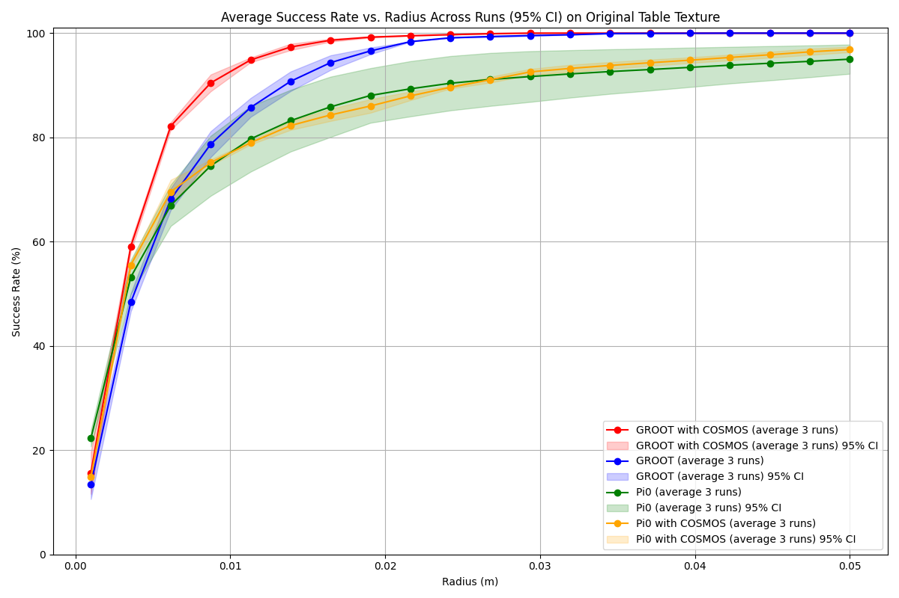
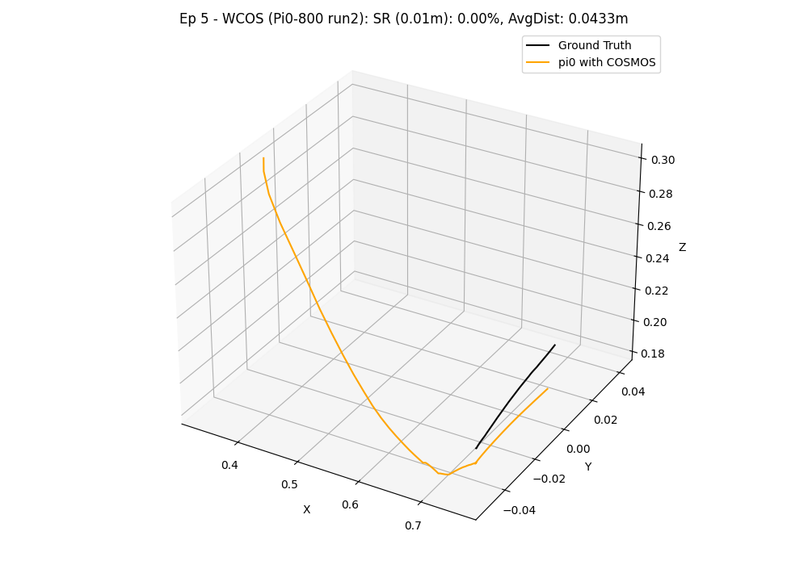

# Trajectory Evaluation

After running simulations and collecting predicted trajectories (e.g., using `sim_with_dds.py` with the `--hdf5_path` and `--npz_prefix` arguments), you can use the `evaluate_trajectories.py` script to compare these predictions against ground truth trajectories.

This script is located at `workflows/robotic_ultrasound/scripts/simulation/evaluation/evaluate_trajectories.py`.

## Quick Start

```sh
python -m simulation.evaluation.evaluate_trajectories \
  --data_root /path/to/data \
  --method-name MyModel \
  --ps-file-pattern "model_output/preds_{e}.npz" ...
```

## Overview

The script performs the following main functions:

1. **Loads Data**: Reads ground truth trajectories from HDF5 files (e.g., `data_{e}.hdf5`) and predicted trajectories from `.npz` files based on configured file patterns.
2. **Computes Metrics**: For each episode and each prediction source, it calculates:
    * **Success Rate**: The percentage of ground truth points that are within a specified radius of any point in the predicted trajectory.
    * **Average Minimum Distance**: The average distance from each ground truth point to its nearest neighbor in the predicted trajectory.
3. **Generates Plots and Outputs**:
    * Console output summarizing progress and final average metrics per method.
    * Individual 3D trajectory plots comparing the ground truth and a specific prediction for each episode.
    * A summary plot showing the mean success rate versus different radius, including 95% confidence intervals, comparing all configured prediction methods.

## Usage

```sh
python -m simulation.evaluation.evaluate_trajectories \
    --data_root /path/to/your/data_and_predictions \
    --method-name WCOS --ps-file-pattern "800/pi0_robot_obs_{e}.npz" --ps-label "With COSMOS" --ps-color "red" \
    --method-name WOCOS --ps-file-pattern "400/pi0_robot_obs_{e}.npz" --ps-label "Without COSMOS" --ps-color "green" \
    --radius_for_plots 0.01 \
    --radius_to_test "0.001,0.05,20" \
    --saved_compare_name "comparison_success_rate_vs_radius.png"
```

*Adjust `data_root` and other parameters as needed.*

## Configuration

The script is primarily configured via command-line arguments. If prediction sources are not specified via the command line, it falls back to a default set defined within the script.

Key Command-Line Arguments:

| Argument | Type | Default | Description |
| -------- | ---- | ------- | ----------- |
| `--episode` | int | None | Number of episodes to process. If None, it processes all episodes found in `data_root` (based on `.hdf5` files). |
| `--data_root` | str | `/mnt/hdd/cosmos/heldout-test50` | Root directory for HDF5 ground truth files (e.g., `data_{e}.hdf5`) and predicted `.npz` trajectory files. |
| `--radius_for_plots` | float | `0.01` | Radius (in meters) used for calculating success rate in individual 3D trajectory plot titles. |
| `--radius_to_test` | str | `"(0.001,0.05,20)"` | Comma-separated string `"(start,end,num_points)"` for the success rate vs. radius plot (e.g., `"0.001,0.05,20"`). |
| `--saved_compare_name` | str | `comparison_success_rate_vs_radius.png` | Filename for the summary plot (success rate vs. radius). |
| `--method-name` | str | (appendable) | Name/key for a prediction source (e.g., `WCOS`). Specify once for each source you want to evaluate. |
| `--ps-file-pattern` | str | (appendable) | File pattern for a prediction source's `.npz` files (e.g., `"my_model/pred_{e}.npz"`). `{e}` is replaced by episode number. Must match order of `--method-name`. |
| `--ps-label` | str | (appendable) | Label for a prediction source (for plots). Must match order of `--method-name`. |
| `--ps-color` | str | (appendable) | Color for a prediction source (for plots). Must match order of `--method-name`. |

**Defining Prediction Sources via CLI (Recommended):**

To evaluate one or more prediction methods, provide their details using the `--method-name`, `--ps-file-pattern`, `--ps-label`, and `--ps-color` arguments. Each of these arguments should be used once for each method you want to compare. For example, to compare two methods "MethodA" and "MethodB":

```sh
python -m simulation.evaluation.evaluate_trajectories \
    --method-name MethodA --ps-file-pattern "path/to/methodA/results_{e}.npz" --ps-label "Method A Results" --ps-color "blue" \
    --method-name MethodB --ps-file-pattern "path/to/methodB/results_{e}.npz" --ps-label "Method B Results" --ps-color "green" \
    # ... other arguments like --data_root, --episode etc.
```

**Default Prediction Sources:**

If no prediction source arguments (`--method-name`, etc.) are provided via the command line, the script will use a predefined default set of prediction sources hardcoded in the `evaluate_trajectories.py` file. This typically includes methods like "WCOS" and "WOCOS".

The script expects predicted trajectory files to be found at `data_root/file_pattern`.

## Downloading Model Weights

We provide the two best-performing relative action space model weights that use Cosmos augmentation: **nvidia/Liver_Scan_Pi0_Cosmos_Rel** and **nvidia/Liver_Scan_Gr00t_Cosmos_Rel** on Hugging Face. If you require access to other model weights (such as absolute action space or non-cosmos variants), please create a ticket or contact us directly.

## Understanding the Outputs & Experiment Results Comparison

The `evaluate_trajectories.py` script generates several outputs to help you assess the performance of trajectory prediction methods. Below is a description of these outputs, along with an example showcasing a comparison between Pi0 and GR00T-N1 models.

### Console Output

* **Progress**: Prints status messages indicating the current episode being processed for each method.
* **Individual Episode Metrics**: For each episode and each prediction method, it prints the calculated Success Rate (SR) at the `radius_for_plots` and the Average Minimum Distance (AvgMinDist).

     ```text
       WCOS - Ep 0: SR (0.01m) = 75.20%, AvgMinDist = 0.0085m
     ```

* **Overall Summary**: At the end, it prints the mean Success Rate and mean Average Minimum Distance for each method, averaged over all processed episodes.

     ```text
     --- Overall Summary (using radius= 0.01 m) ---
     Method: WCOS
       Avg Success Rate: 78.50%
       Avg Min Distance: 0.0075m
     Method: WOCOS
       Avg Success Rate: 72.30%
       Avg Min Distance: 0.0092m
     ```

### Example Evaluation Table

In our experiments, we utilized the `liver_scan_sm.py` script to collect an initial dataset of 400 raw trajectories. This dataset was then augmented using the Cosmos-transfer1 model to generate an additional 400 trajectories with diverse visual appearances (1:1 ratio with raw data), effectively creating a combined dataset for training and evaluation. The following table presents a comparison of success rates (at a 0.01m radius) for different policy models (Pi0 and GR00T-N1 variants) evaluated under various texture conditions in the simulated environment. Models with **-rel** suffix use **relative action space**, while models with **-abs** suffix use **absolute action space**. All models are trained using **full fine-tuning** (no LoRA).
Our model was tested on both the original texture and several unseen textures. To enable these additional textures for testing, uncomment the `table_texture_randomizer` setting within the [environment configuration file](../exts/robotic_us_ext/robotic_us_ext/tasks/ultrasound/approach/config/franka/franka_manager_rl_env_cfg.py).

### Evaluation Table: Success Rates (%) (@0.01m)

| Model | Original Texture | Texture 1 (Stainless Steel) | Texture 2 (Bamboo Wood) | Texture 3 (Walnut Wood) |
| ----- | ---------------- | -------------------------- | ---------------------- | ---------------------- |
| Pi0-400-rel | 84.5 | 61.2 | 63.4 | 59.6 |
| GR00T-N1-400-rel | 84.1 | 61.5 | 58.3 | 64.0 |
| Pi0-800-rel (w/ cosmos) | 90.0 | 77.6 | 83.1 | 84.8 |
| GR00T-N1-800-rel (w/ cosmos) | 92.8 | 91.1 | 92.8 | 91.7 |
| Pi0-400-abs | 96.5 | 97.0 | 96.3 | 11.6 |
| GR00T-N1-400-abs | 99.3 | 10.6 | 19.1 | 20.4 |
| Pi0-800-abs (w/ cosmos) | 97.7 | 94.5 | 95.8 | 93.8 |
| GR00T-N1-800-abs (w/ cosmos) | 98.8 | 85.1 | 84.7 | 87.6 |

### Success Rate vs. Radius Plot

* A plot named by the `--saved_compare_name` argument (default: `comparison_success_rate_vs_radius.png`) is saved in the `data_root` directory.
* This plot shows the mean success rate (y-axis) as a function of the test radius (x-axis) for all configured prediction methods.
* It includes 95% confidence interval bands for each method.

  **Example Success Rate vs. Radius Plots:**
  

The example plot visually represents comparisons between different models, where each method is color-coded. The x-axis represents the tolerance radius in meters, and the y-axis shows the corresponding mean success rate. The shaded areas around the lines indicate the 95% confidence intervals, providing a measure of result variability.

### 3D Trajectory Plots

* For each episode and each prediction method, a 3D plot is generated and saved.
* The path for these plots is typically `data_root/METHOD_NAME/3d_trajectories-{episode_number}.png`.
* These plots visually compare the ground truth trajectory against the predicted trajectory.
* The title of each plot includes the episode number, method name, success rate at `radius_for_plots`, and average minimum distance.

   **Example 3D Trajectory Visualization:**

   

   In this visualization, the ground truth trajectory (derived from the 'scan' state) is depicted in black, while the colored line represents the predicted trajectory from the model.

### Key Observations and Conclusion

The evaluation results from our experiments offer several insights into model performance. Models are trained with either relative action space (-rel suffix) or absolute action space (-abs suffix), all using full fine-tuning.

* **Effect of Cosmos-transfer Data Augmentation:** In our tests, augmenting the training dataset with Cosmos-transfer appeared to enhance policy success rates and robustness to three tested unseen table textures when compared to models trained solely on the original dataset. For example, the GR00T-N1-800-rel model showed more consistent performance across tested textures. Data augmentation, while beneficial for diversity, does require additional computational resources for generating and processing the augmented samples.

* **Reproducibility and Result Variability:** Users conducting their own evaluations might observe slightly different numerical results. This can be due to several factors, including inherent stochasticity in deep learning model training, variations in computational environments, and specific versions of software dependencies. For instance, initial explorations indicated that components like the `PaliGemma.llm` from OpenPI ([OpenPI PaliGemma.llm source](https://github.com/Physical-Intelligence/openpi/blob/main/src/openpi/models/pi0.py#L311)) could introduce variability. To ensure the stability and reliability of the findings presented here, the reported metrics for each model are an average of three independent evaluation runs.

These observations highlight the potential benefits of data augmentation strategies like Cosmos-transfer for developing robotic policies, especially for tasks involving visual perception in dynamic environments. The choice of model architecture, training duration , and training methodology (e.g., relative action space, whether to employ LoRA, and whether fine-tune LLM) are all important factors influencing final performance. Further investigation and testing across a wider range of scenarios are always encouraged.
