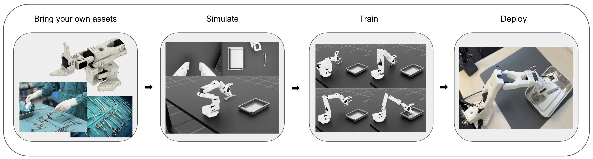
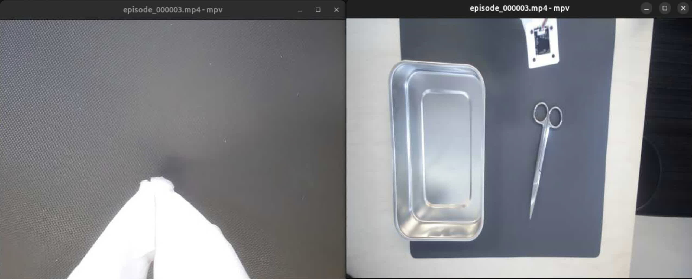

# SO-ARM Starter Workflow



## 🔬 Overview

The SO-ARM Starter Workflow demonstrates autonomous surgical instrument handling with the [SO-ARM101 robotic arm](https://huggingface.co/docs/lerobot/en/so101) and an [NVIDIA GR00T N1.5 vision-language policy](https://developer.nvidia.com/isaac/gr00t). You can collect teleoperation data in [NVIDIA Isaac Sim](https://developer.nvidia.com/isaac/sim) or on real hardware, train or fine-tune the policy on your data, and then deploy to simulation or a physical SO-ARM101.

The SO-ARM Starter workflow consists of three main phases: data collection, model training, and policy deployment. Each phase can be run independently or as part of a complete pipeline.

## 📋 Table of Contents

- [🔬 Overview](#-overview)
- [Setup](#setup)
  - [Hardware Requirements](#hardware-requirements)
  - [Software Requirements](#software-requirements)
  - [RTI Connext DDS Prerequisites](#rti-connext-dds-prerequisites)
  - [Enable SO-ARM101 Serial Communication](#enable-so-arm101-serial-communication)
  - [Set up the Real Scene (Optional)](#set-up-the-real-scene-optional)
- [🤖 Quick Start: Deploy the Default Policy in Simulation](#-quick-start-deploy-the-default-policy-in-simulation)
- [🤖 Quick Start: Deploy the Default Policy to Real SO-ARM Hardware](#-quick-start-deploy-the-default-policy-to-real-so-arm-hardware)
- [Guide: Collect Data with SO-ARM101 Leader or Keyboard](#guide-collect-data-with-so-arm101-leader-or-keyboard)
- [🎯 Guide: Fine-tune a Policy for SO-ARM101](#-guide-fine-tune-a-policy-for-so-arm101)
- [🚀 Guide: Deploy a Custom Policy](#-guide-deploy-a-custom-policy)
- [User Guide: Workflow CLI Commands](#user-guide-workflow-cli-commands)
- [🛠️ Troubleshooting](#troubleshooting)
- [📊 Latency Benchmarking](#-latency-benchmarking)
- [References](#references)

## Setup

### Hardware Requirements

This workflow supports the following platforms:

| Platform | Supports | Additional Notes |
| - | - | - |
| x86_64 Workstation | Simulation, training, and real deployment | Requires Intel or AMD CPU and NVIDIA GPU (Ampere or later) with ≥30GB GDDR6/HBM RAM |
| [NVIDIA DGX Spark Workstation](https://www.nvidia.com/en-us/products/workstations/dgx-spark/) | Simulation, training, and real deployment | Append `--docker-file=workflows/so_arm_starter/docker/dgx.Dockerfile` to demo commands, or update the [metadata `dockerfile` field](metadata.json) |
| [NVIDIA Jetson Thor](https://www.nvidia.com/en-us/autonomous-machines/embedded-systems/jetson-thor/) | Deployment | Append `--docker-file=workflows/so_arm_starter/docker/dgx.Dockerfile` to demo commands, or update the [metadata `dockerfile` field](metadata.json) |
| [NVIDIA Jetson Orin](https://www.nvidia.com/en-us/autonomous-machines/embedded-systems/jetson-orin/) | Deployment | Append `--docker-file=workflows/so_arm_starter/docker/orin.Dockerfile --as-root` to demo commands, or update the [metadata `dockerfile` field](metadata.json) |

- **SO-ARM101 Robotic Arm Developer Kit**: This 6-degree-of-freedom (6-DOF) manipulator provides the mechanical foundation for the SO-ARM Starter workflow. For detailed specifications and hardware recommendations, see the official [SO‑ARM 101 hardware recommendations](https://github.com/TheRobotStudio/SO-ARM100/tree/385e8d7c68e24945df6c60d9bd68837a4b7411ae?tab=readme-ov-file#kits).
  - **SO-ARM101 Follower Arm**: 6DOF robot manipulator with gripper and wrist-mounted camera module.
  - **SO-ARM101 Leader Arm**: 6DOF teleoperation interface for data collection.
- **External USB Camera**: An external USB camera (not an integrated laptop camera) with 1080p resolution and 30fps capability.
- **Props for Default Deployment**: If demoing the default policy on real hardware, you will need to recreate the surgical scene with a table, scissors, and a tray matching the training environment.

#### Platform-Specific Notes

**DGX Spark / Orin / Thor:**

- Build times may be longer (~20-60 minutes) due to compilation of architecture-specific dependencies.
- Ensure sufficient disk space (50GB+) for build cache.
- The ARM64 SBSA and Tegra iGPU Dockerfiles ([`dgx.Dockerfile`](docker/dgx.Dockerfile), [`orin.Dockerfile`](docker/orin.Dockerfile) use base images that are optimized for the ARM64 architecture. The SBSA container is compatible with DGX Spark or Jetson AGX Thor platforms, whereas the iGPU container is compatible with Jetson Orin (Jetpack 6.x) platforms.

The simulation environment will run on the host and not in a container. The simulation process may communicate
with a policy deployment across container boundaries via DDS.

**x86_64:**

- TensorRT optimization recommended for real-time deployment.
- Generally has the fastest optimized inference performance. See [benchmarks](#-latency-benchmarking) for details.

### Software Requirements

- **Operating System**: Ubuntu 22.04/24.04 LTS
- **NVIDIA Driver**: ≥535.0
- **Docker** with NVIDIA GPU support

### RTI Connext DDS Prerequisites

This workflow relies on [RTI Connext 7.3.0](https://content.rti.com/l/983311/2025-07-08/q5x1n8) for DDS communication.
To obtain a license/activation key, see the [RTI Connext Express registration page](https://content.rti.com/l/983311/2025-07-25/q6729c). Please see the [usage rules](https://www.rti.com/products/connext-express) for Connext Express.

Set up your host environment a path to your local license or a URL to download a new evaluation license:

```bash
# Pre-downloaded license file on the host system
export RTI_LICENSE_FILE=/path/to/your/rti_license.dat

# Or, URL to retrieve a new evaluation license
export RTI_LICENSE_URL="https://content.rti.com/l/983311/2025-07-25/q6729c"
```

**RTI Connext DDS Multicast Discovery:** Please open ports 7400 and 7401 in your firewall to enable RTI DDS multicast to and from the static IPv4 `239.255.0.1`. Refer to [RTI Connext DDS documentation](https://community.rti.com/content/forum-topic/statically-configure-firewall-let-omg-dds-traffic-through) for details.

```bash
sudo ufw allow in proto udp to 239.255.0.1 port 7400:7401
sudo ufw allow out proto udp to 239.255.0.1 port 7400:7401
```

### Enable SO-ARM101 Serial Communication

> [!NOTE]
> First-time setup with `./i4h run` may take up to one hour.

```bash
# Run and follow the prompts to identify leader and follower arm ports
./i4h run so_arm_starter find_ports

# Update permissions as needed
sudo chmod 666 </dev/ttyUSB0>
sudo chmod 666 </dev/ttyUSB1>
```

> [!TIP]
> The workflow may request that you calibrate your SO-ARM101 on your first run. Please refer to the [calibration video](https://huggingface.co/docs/lerobot/so101#calibrate) for guidance.

### Set up the Real Scene (Optional)

If deploying the pre-trained GR00T N1.5 policy on real SO-ARM101 hardware, please set up the physical scene to match the training environment as shown below, with the wrist camera view matching the left image and room camera view matching the right image.



Run the following command to capture and review images from each camera:

```bash
./i4h run so_arm_starter find_cameras
```

## 🤖 Quick Start: Deploy the Default Policy in Simulation

In this guide we run the simulated SO-ARM101 in the default demo simulation environment with our pre-trained GR00T N1.5 model to "pick and place" surgical instruments on a table.

> [!NOTE]
> First-time setup with `./i4h run` may take up to one hour.

### Step 1: Launch the Simulation Environment

```bash
./i4h run so_arm_starter sim_env
```

This starts Isaac Sim with the robot scene. Keep this terminal running.

### Step 2: Run the Policy (New Terminal)

```bash
./i4h run so_arm_starter policy
```

You should now see the simulated robot arm moving to pick the surgical scissors and place them in the tray.

## 🤖 Quick Start: Deploy the Default Policy to Real SO-ARM Hardware

In this guide we run our pre-trained GR00T N1.5 model with the physical SO-ARM101 follower arm to "pick and place" real surgical instruments.

The pre-trained model is trained with the following parameters:

- **Text Prompt**: `Grip the scissors and put it into the tray`
- **Fixed Camera Views**: wrist camera (left) and room camera (right)

First, update [`soarm_robot_config.yaml`](../../workflows/so_arm_starter/scripts/holoscan_apps/soarm_robot_config.yaml) with the serial port for your SO-ARM 101 follower arm. Then, run the pre-trained policy to drive the SO-ARM follower arm via serial communications:

```bash
./i4h run so_arm_starter real_deploy
```

## Guide: Collect Data with SO-ARM101 Leader or Keyboard

In this guide we teleoperate a simulated follower arm with a real leader arm to collect policy training data.

### Collect Data in Isaac Sim

Run the following command to teleoperate the SO-ARM device with the real leader and simulated follower device. Once the Isaac Sim scene loads, you will see the simulated follower arm respond to the leader. Follow the console prompts to exit when you are done with training collection.

```bash
# Leader arm teleoperation with recording
./i4h run so_arm_starter sim_teleop --run-args=" \
  --port=</dev/ttyUSB0> \
  [--dataset_path=my_demo.hdf5]"   # use the serial port for your follower arm
```

Data will be available at `i4h-workflows/data/so_arm_starter/my_demo.hdf5`.

### Replay Recording in Isaac Sim (Optional)

You may replay collected training episodes in Isaac Sim to verify quality:

```bash
./i4h run so_arm_starter replay --run-args="\
    --dataset_path=my_demo.hdf5"
```

### Alternative: Collect Data with Keyboard-Based Teleoperation

For users without SO-ARM101 hardware, keyboard-based teleoperation is available for simulation.

> [!WARNING]
> The leader arm provides much more control than the keyboard teleop. We strongly recommend using the leader arm for data collection.

Run the command below to teleoperate the simulated SO-ARM follower arm with a standard keyboard.

```bash
./i4h run so_arm_starter sim_keyboard --run-args="\
  [--dataset_path=keyboard_demo.hdf5]"
```

Data will be available at `i4h-workflows/data/so_arm_starter/keyboard_demo.hdf5`.

**Simulation Controls:**

- **R Key**: Reset recording environment and stop current recording
- **N Key**: Mark episode as successful and reset environment
- **Keyboard Controls** (when using keyboard teleop):
  - **Joint 1 (shoulder_pan)**: Q (+) / U (-)
  - **Joint 2 (shoulder_lift)**: W (+) / I (-)
  - **Joint 3 (elbow_flex)**: E (+) / O (-)
  - **Joint 4 (wrist_flex)**: A (+) / J (-)
  - **Joint 5 (wrist_roll)**: S (+) / K (-)
  - **Joint 6 (gripper)**: D (+) / L (-)

These keyboard controls differ from the Isaac Sim default **Se3Keyboard** controls. For more information please refer to the [leisaac project implementation](https://github.com/LightwheelAI/leisaac/blob/v0.2.0/source/leisaac/leisaac/devices/keyboard/se3_keyboard.py).

### Alternative: Collect Data with Real SO-ARM101 Leader and Follower Teleoperation

Users with SO-ARM101 hardware may choose to collect real-world data in addition to or in place of Isaac Sim training episodes.

Run the command below to use lerobot scripts to teleoperate the real SO-ARM follower arm with the real SO-ARM leader arm.

```bash
./i4h run so_arm_starter teleop_real --run-args="\
    --robot.port=<follower_port_id> \
    --teleop.port=<leader_port_id> \
    --dataset.repo_id=<datasets/test> \
    --dataset.single_task='<task description>' \
    [--display_data=true] \
    [--dataset.num_episodes=5] \
    [--dataset.episode_time_s=60] \
    [--dataset.reset_time_s=60]
```

Recorded datasets will be available by default at `./.cache/huggingface/lerobot`.

> [!TIP]
> For more details about real-world data collection using physical SO-ARM101 hardware, refer to the [LeRobot Data Collection Documentation](https://huggingface.co/docs/lerobot/main/en/getting_started_real_world_robot).

## 🎯 Guide: Fine-tune a Policy for SO-ARM101

> [!NOTE]
> Please collect training data before proceeding to training.

### Convert Isaac Sim Teloperation Data

If you collected training data with Isaac Sim, first convert data into LeRobot format for GR00T fine-tuning:

```bash
# Update training data permissions
chown $(id -u):$(id -g) path/to/my_demo.hdf5

# Convert HDF5 to LeRobot format
# Output data will be available at .cache/huggingface/lerobot/my_dataset
./i4h run so_arm_starter convert --run-args="\
  --repo_id=<my_dataset> \
  --hdf5_path=<my_demo.hdf5> \
  --task_description=<'My pick and place task'>"
```

### Run GPU-based Fine-Tuning

Run the following command to use your teleoperation data to fine-tune the GR00T N1.5 pre-trained model:

```bash
./i4h run so_arm_starter train --run-args="\
  --dataset_path=</workspace/i4h/.cache/huggingface/lerobot/my_dataset> \
  --output_dir=</workspace/i4h/data/so_arm_starter/checkpoints> \
  [--batch_size=32] \
  [--max_steps=10000]"
```

> [!TIP]
> If you see an "out of memory" error on DGX Spark or another supported training platform,
> please reduce your batch size using the parameters above.

### Convert to TensorRT Engine (Optional)

Please refer to the [TensorRT Inference section](../so_arm_starter/scripts/policy/README.md#tensorrt-inference) to convert the resulting policy checkpoint to an optimized [NVIDIA TensorRT](https://developer.nvidia.com/tensorrt) engine file.

## 🚀 Guide: Deploy a Custom Policy

### Deploy to Simulated SO-ARM

Launch the simulation environment:

```bash
./i4h run so_arm_starter sim_env
```

Run the policy in another terminal or process:

```bash
./i4h run so_arm_starter policy --run-args="\
  [--ckpt_path=path/to/ckpt] \
  [--task_description='Custom task']"
```

### Deploy to Real SO-ARM

Update [`soarm_robot_config.yaml`](../../workflows/so_arm_starter/scripts/holoscan_apps/soarm_robot_config.yaml) with the mount path to the model folder path or TensorRT engine path. Note that the `i4h-workflows` path will mount to the `/workspace/i4h` container path by default, please update paths accordingly.

Then, run the following command on the host system with the SO-ARM device connected:

```bash
./i4h run so_arm_starter real_deploy
```

## User Guide: Workflow CLI Commands

The SO-ARM Starter Workflow provides a collection of convenient tools for common user operations. Please refer to the table for details.

### Setup & Calibration

| Mode | Description | Required `--run-args` |
| ---- | ----------- | -------------------- |
| `calibrate_follower` | Calibrate follower arm | `--robot.port=/dev/ttyUSBx` |
| `calibrate_leader` | Calibrate leader arm | `--teleop.port=/dev/ttyUSBx` |
| `download_model` | Download pretrained SO-ARM Starter model | Override: `--local-dir /path` |
| `find_cameras` | Find available camera indices | None |
| `find_ports` | Find SO-ARM101 serial USB ports | None |
| `login_hf` | Log in to Hugging Face (optional, for gated models) | None |

### Phase 1: Data Collection

| Mode | Description | Required `--run-args` |
| ---- | ----------- | -------------------- |
| `sim_keyboard` | Isaac Sim + keyboard control | None (optional: `--record --dataset_path=/path`) |
| `sim_teleop` | Isaac Sim + leader arm teleoperation | `--port=/dev/ttyUSBx` |
| `replay` | Replay recorded datasets | `--dataset_path=/container/path/to/data.hdf5` |

### Phase 2: Model Training

| Mode | Description | Required `--run-args` |
| ---- | ----------- | -------------------- |
| `convert` | Convert HDF5 to LeRobot format | `--repo_id=name --hdf5_path=/path --task_description="..."` |
| `train` | Train GR00T N1.5 model | `--dataset_path=/path --output_dir=/path` |

### Phase 3: Deployment

| Mode | Description | Required `--run-args` |
| ---- | ----------- | -------------------- |
| `policy` | Run policy inference | None (uses downloaded model by default) |
| `real_deploy` | Deploy to real hardware | `--config=/path/to/config.yaml` |
| `sim_env` | Launch Isaac Sim with DDS | None |

### Common CLI Options

| Command or Flag | Summary | Example |
| - | - | - |
| `modes` | Show all available modes for this workflow | `./i4h modes so_arm_starter` |
| `run-container` | Launch an interactive session in the demo container | `./i4h run-container so_arm_starter` |
| `--local` | Build and run on the host platform without relying on Docker containers | `./i4h run so_arm_starter sim_keyboard --local` |
| `--no-docker-build` | Run in the container without attempting to rebuild the container | `./i4h run so_arm_starter policy --no-docker-build` |
| `--dryrun` | View underlying CLI calls without running them | `./i4h run so_arm_starter sim_keyboard --dryrun` |
| `--build-args` | Custom arguments passed to `docker build` | `./i4h run so_arm_starter policy --build-args="--progress=plain"` |
| `--docker-opts` | Custom arguments passed to `docker run` | `./i4h run so_arm_starter policy --docker-opts="-v /path/to/host/folder:/path/to/container/mount"` |
| `--verbose` | Run with verbose output | `./i4h run so_arm_starter sim_keyboard --verbose` |
| `--help` | Show CLI help | `./i4h run --help` |

### Useful Environment Variables

| Variable | Description |
| -------- | ----------- |
| `RTI_LICENSE_FILE` | Path to RTI DDS license file |
| `RTI_LICENSE_URL` | URL for RTI license download (used when RTI_LICENSE_FILE is not set) |
| `HOLOHUB_ALWAYS_BUILD` | Set to `false` to skip container rebuild |
| `HOLOHUB_BUILD_LOCAL` | Set to `1` for local builds |
| `HOLOHUB_DATA_PATH` | Set the parent directory for data read/write. Default: `i4h-workflows/data` directory, mounted at `/workspace/i4h/data` |

## Troubleshooting

> [!NOTE]
> Issue not resolved? Please submit a report at the [Isaac for Healthcare Workflows GitHub Issues board](https://github.com/isaac-for-healthcare/i4h-workflows/issues).

### 1. RTI DDS License Issues

```text
RTI Connext DDS No source for License information
rti.connextdds.Error: Failed to create DomainParticipant
```

**Solution:**

This workflow requires [RTI Connext Express](https://content.rti.com/l/983311/2025-07-08/q5x1n8). To obtain a license/activation key, see the [RTI Connext Express registration page](https://content.rti.com/l/983311/2025-07-25/q6729c). Please see the [usage rules](https://www.rti.com/products/connext-express) for Connext Express.

```bash
# Set your RTI license file path
export RTI_LICENSE_FILE=/path/to/your/rti_license.dat

# Verify it's set correctly
echo $RTI_LICENSE_FILE
ls -la $RTI_LICENSE_FILE

# Check file permissions
chmod 644 $RTI_LICENSE_FILE

# Try running again
./i4h run so_arm_starter policy
```

**Note:** When `RTI_LICENSE_FILE` is set, the `i4h` CLI automatically mounts the license file into the container at `/opt/rti/rti_license.dat`. This applies to all DDS-based modes (`sim_env`, `policy`, `real_deploy`).

### 2. SO-ARM101 USB Device Not Found

```text
No serial ports found
```

- Verify the SO-ARM device is connected and powered on.
- Check device connection: `ls /dev/ttyUSB* /dev/ttyACM*`
- Ensure user has permissions: `sudo usermod -a -G dialout $USER`
- Review [SO-ARM setup](#enable-so-arm101-serial-communication) and verify device ports

### 3. Container Build Fails

- Try removing old images and then re-running:

```bash
docker images | grep so_arm_starter
docker rmi <image_id>
```

- Try rebuilding without the Docker cache: `./i4h build-container so_arm_starter --no-cache`
- Verify that you are using the correct Dockerfile for your platform
- [Report the issue in the Isaac for Healthcare GitHub project](https://github.com/isaac-for-healthcare/i4h-workflows/issues)

### 4. Docker Build or Run fails with `exec format error`

```text
exec format error
standard_init_linux.go: exec user process caused: exec format error
```

- You may not be using the correct Dockerfile for your platform. Review which platform you are targeting, then use the appropriate `--docker-file`:

- `x86_64` → Use default `docker/Dockerfile` (or omit flag)
- `aarch64` DGX Spark → Use `--docker-file=workflows/so_arm_starter/docker/dgx.Dockerfile`
- `aarch64` Orin AGX → Use `--docker-file=workflows/so_arm_starter/docker/orin.Dockerfile`
- `aarch64` Thor → Use `--docker-file=workflows/so_arm_starter/docker/dgx.Dockerfile`

### 5. SO-ARM not moving / DDS publisher and subscriber not communicating

RTI Connext DDS relies on networking communication across multiple ports for discovery and participation in DDS publish/subscribe mechanisms. If DDS multicast discovery fails,
you may see the demo applications run without any clear output behavior, and the last console message may show the apps are waiting for DDS subscriptions.

```bash
# Policy process never receives SO-ARM information from Isaac Sim
0:topic_soarm_info - Thread is reading data => topic_soarm_info
```

```bash
# Isaac Sim simulation environment never receives policy directives
episode_idx: 0
0:topic_soarm_ctrl - Thread is reading data => topic_soarm_ctrl
```

Please visit [RTI Connext DDS documentation](https://community.rti.com/content/forum-topic/statically-configure-firewall-let-omg-dds-traffic-through) for details on setting up firewall rules. We recommend running the SO-ARM starter workflow on a single workstation and with DDS domain ID 0 (default). If using [UFW](https://wiki.ubuntu.com/UncomplicatedFirewall) on Linux, the resulting commands to enable DDS communication for the app would be:

```bash
sudo ufw allow in proto udp to 239.255.0.1 port 7400:7401
sudo ufw allow out proto udp to 239.255.0.1 port 7400:7401
sudo ufw allow in  on lo
sudo ufw allow out on lo
```

With the resulting firewall configuration:

```bash
To                         Action      From
--                         ------      ----
...
239.255.0.1 7400:7401/udp  ALLOW       Anywhere
239.255.0.1 7400:7401/udp  ALLOW OUT   Anywhere
Anywhere on lo             ALLOW       Anywhere
Anywhere                   ALLOW OUT   Anywhere on lo
```

When the Isaac Sim processes launches, after a short initialization and discovery delay you should see that the simulated SO-ARM begins to move and execute the scissors pick-and-place task. At the end of each episode the scene will reload and you will
see new output in the console window indicating the episode is re-starting.

```bash
episode_idx: 0
0:topic_soarm_ctrl - Thread is reading data => topic_soarm_ctrl

# New output on each episode
episode_idx: 0

episode_idx: 0
```

**If issues persist**: Please temporarily disable your firewall and re-launch the DDS-based applications. Consider the [dds-ping](https://hub.docker.com/r/rticom/dds-ping) utility for further DDS network debugging.

### 6. General Python Inspection and Debugging

For detailed Python script options:

```bash
# Enter container interactively
./i4h run-container so_arm_starter

# Then check individual script help
python -m simulation.environments.teleoperation_record --help
python -m training.gr00t_n1_5.train --help
```

### 7. `Failed to create shared memory named carb-RStringInternals-64` (non-root)

Isaac Sim’s carb library can fail with:

```text
Assertion (false) failed: Failed to create shared memory named carb-RStringInternals-64
```

This may occur when the container uses the host’s IPC namespace (`--ipc=host`): a previous run as **root** may have left a shared memory segment in `/dev/shm` that a non-root user cannot replace or access.

**Options:**

1. **Re-run the container**: May work on second attempt if host shared memory has been cleaned up between runs
2. **Request dedicated shared memory**: Run with `--docker-opts="--shm-size=2g"` or similar to request shared memory
3. **Run as root** to bypass permission issues: `./i4h run so_arm_starter sim_env --as-root`

## 📊 Latency Benchmarking

This section presents inference latency benchmarks for model [SO-ARM Starter GR00T](https://huggingface.co/nvidia/SO_ARM_Starter_Gr00t) across various NVIDIA platforms. All measurements use batch size 1, FP16 precision, dual camera input, and averaged over 100 rounds.

| Platform | Mode | E2E Latency (ms) |
| ---------- | ------ | ------------------ |
| **X86_64 + RTX 6000 Ada** | PyTorch | 42.08 ± 0.69 |
| **X86_64 + RTX 6000 Ada** | TensorRT | 24.54 ± 0.63 |
| **AGX Orin** | PyTorch | 507.47 ± 5.65 |
| **AGX Orin** | TensorRT | 359.82 ± 3.37 |
| **IGX Thor (iGPU)** | PyTorch | 107.85 ± 4.97 |
| **IGX Thor (iGPU)** | TensorRT | 75.86 ± 8.98 |
| **AGX Thor** | PyTorch | 109.43 ± 4.59 |
| **AGX Thor** | TensorRT | 77.91 ± 9.63 |
| **DGX Spark** | PyTorch | 124.32 ± 4.20 |
| **DGX Spark** | TensorRT | 114.72 ± 5.34 |

## References

- Our pre-trained GR00T N1.5 model used throughout this workflow is hosted on HuggingFace: [SO-ARM Starter GR00T](https://huggingface.co/nvidia/SO_ARM_Starter_Gr00t)
- For more details about policy inference and deployment using trained GR00T models, refer to the [Isaac GR00T Policy Deployment](https://github.com/NVIDIA/Isaac-GR00T/blob/17a77ebf646cf13460cdbc8f49f9ec7d0d63bcb1/getting_started/5_policy_deployment.md) and [Jetson Container Deployment](https://github.com/NVIDIA/Isaac-GR00T/tree/d18bfc3a3b4ad6432649e364af2b62f483d7cfee/deployment_scripts#deploy-isaac-gr00t-with-container)
- For detailed SO-ARM101 leader assembly and setup instructions, refer to the [LeRobot SO-ARM101 Documentation](https://huggingface.co/docs/lerobot/so101).
- The simulated SO‑ARM 101 model is derived from the
[original SO‑ARM 101 URDF](https://github.com/TheRobotStudio/SO-ARM100/blob/385e8d7c68e24945df6c60d9bd68837a4b7411ae/Simulation/SO101/so101_new_calib.urdf) and
augmented with STL geometry provided by [**WOWROBO**](https://wowrobo.com/) for the wrist camera module and its mounting adapter. These assets are consolidated into the single USD file: `SO-ARMDualCamera.usd`.
